# Da Vulnerabilidade ao Deploy Seguro: DevSecOps na BancoFácil Digital

**Aluno:** Anthony Muller
**Disciplina:** Segurança da Informação — Unifebe
**Repositório:** https://github.com/AnthonyViniciusMuller/banco-facil-api
**Imagem publicada:** `ghcr.io/anthonyviniciusmuller/banco-facil-api`

---

# Parte 1 — Pesquisa teórica

## 1. Shift Left e Shift Right

Desenhando o ciclo de vida do software como uma linha do tempo horizontal, o tempo corre da esquerda para a direita: requisitos e design à esquerda, produção à direita. Shift Left é antecipar a verificação para as fases mais à esquerda; Shift Right é levá-la para depois do deploy, tratando a produção como ambiente legítimo de teste, sob controle. O termo vem dos testes ágeis (Larry Smith, 2001) e foi adotado pela segurança nos anos 2010, junto com o DevSecOps.

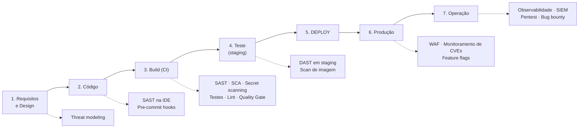

*Figura 1 — A fronteira entre os dois movimentos é o deploy: antes dele é prevenção, depois é detecção e contenção.*

À esquerda ficam SAST, detecção de segredos e SCA. À direita, DAST contra produção, observabilidade com detecção de anomalias (SIEM, WAF) e deploy progressivo com canary ou feature flags. O critério não é a ferramenta, e sim de qual insumo o controle depende: se é o artefato estático, pode ser antecipado; se é o comportamento do sistema sob tráfego real, pertence à direita.

São complementares. Shift Left reduz a probabilidade de a falha chegar à produção; Shift Right reduz o impacto e o tempo de detecção das que chegam assim mesmo. Erros de configuração de ambiente, falhas de autorização e CVEs publicadas depois do deploy escapam de qualquer pipeline. O exemplo mais claro é o último: em 8 de dezembro de 2021 uma aplicação com `log4j-core 2.14.1` passava em qualquer scanner; no dia seguinte, com a divulgação da CVE-2021-44228, a mesma aplicação sem uma linha alterada era crítica.

Sobre custo por fase, a intuição é sólida: quanto mais tarde o defeito aparece, mais artefatos derivados dele já existem. Corrigir no design é mudar um documento; no código, minutos do autor com o contexto fresco; no CI, um novo commit; em staging, um ciclo entre QA e desenvolvimento. Em produção somam-se indisponibilidade ou fraude em curso, plantão, comunicação a clientes e exposição regulatória — para uma fintech, LGPD e normas do Bacen.

O número mais repetido do setor, de que corrigir em produção custa de 30 a 100 vezes mais, merece desconfiança. Ele é atribuído a três fontes: Boehm (*Software Engineering Economics*, 1981), origem legítima da curva, mas medindo projetos em cascata dos anos 70 com releases de anos; o "IBM System Sciences Institute", fonte do gráfico 1x/6.5x/15x/100x que Bossavit tentou rastrear em *The Leprechauns of Software Engineering* sem achar nenhum artigo primário; e o relatório NIST/RTI de 2002, sério, mas sobre custo macroeconômico agregado, não por defeito. A direção da curva é bem sustentada; a magnitude não. Em entrega contínua com rollback automatizado a distância é bem menor do que em 1981 — e esse encurtamento é justamente o argumento do Shift Right. O investimento se defende sem o número inflado: custo de contexto, custo de propagação em dezenas de microsserviços e custo irreversível de um segredo exposto, que não pode ser "descommitado".

## 2. Gestão de segredos

**Secret sprawl** é a proliferação descontrolada de credenciais por sistemas que não foram feitos para guardá-las, a ponto de a organização não saber mais quais segredos existem, onde estão e quem tem acesso. Vazam por commits "temporários" nunca revertidos, arquivos de configuração versionados, imagens Docker com `ENV`, e logs que despejam cabeçalhos de autorização. A armadilha menos óbvia é o histórico do Git: remover o segredo do arquivo não o remove do repositório — ele continua em `git log -p`, em qualquer clone e em qualquer fork. Por isso o Gitleaks varre todo o histórico.

Segredos de build e de runtime são coisas diferentes. Um segredo de build (o `GITHUB_TOKEN` para publicar no GHCR) existe só durante a execução do workflow e mora no cofre do próprio CI. Um segredo de runtime (string de conexão, chave do gateway de pagamentos) precisa existir com a aplicação já rodando, muito depois de o workflow terminar, e deve vir de um cofre com injeção no deploy.

Guardá-lo na imagem é má prática mesmo com registry privado. A imagem não é opaca: qualquer um com permissão de pull extrai o valor com `docker history`. Camadas são imutáveis, então copiar um arquivo e removê-lo depois não apaga nada. A imagem circula muito além do registry — cache dos nós, máquinas de desenvolvedores, backups. E o segredo dentro dela transforma rotação em rebuild, o que na prática significa que a rotação não acontece. Privacidade reduz o alcance, não elimina: em 2016 atacantes obtiveram credenciais de AWS da Uber a partir de um repositório **privado** e chegaram aos dados de 57 milhões de usuários.

As ferramentas se dividem em duas categorias. Detecção: Gitleaks (regex por provedor mais entropia, varrendo o histórico completo), TruffleHog (que ainda verifica se a chave continua válida chamando a API do provedor) e o GitHub Secret Scanning, cujo modo *push protection* rejeita o push no ato — o Shift Left mais puro possível, porque o segredo nunca chega ao servidor. Gerenciamento centralizado: HashiCorp Vault (política de acesso, auditoria, credenciais dinâmicas de TTL curto), AWS Secrets Manager (rotação automática nativa) e Azure Key Vault. A diferença de propósito é a de um alarme de incêndio para um cofre: detecção é controle detectivo, gerenciamento é preventivo. Só o segundo resolve o problema; o primeiro existe porque o segundo nunca será perfeito.

**Rotação** é substituir a credencial por uma nova, invalidando a anterior no sistema que a emitiu. É a única ação que encerra uma exposição, porque remover o segredo do código altera o que está publicado de agora em diante, não o que já foi lido. A chave da BancoFácil ficou seis meses em repositório público — foi clonada, indexada e provavelmente coletada por bots que varrem o GitHub em tempo real, e apagar o arquivo não invalida nenhuma dessas cópias. A ordem certa é rotacionar, auditar os logs do provedor, remover do código e só então considerar reescrever o histórico.

## 3. Proteção e qualidade

**Branch Protection** são regras que a plataforma aplica do lado do servidor sobre um branch. O decisivo é ser server-side: diferente de um hook local, que o desenvolvedor pode não instalar, não há como contorná-la. No GitHub dá para exigir pull request antes do merge, exigir aprovações, exigir que os checks de status passem, exigir o branch atualizado com a base, proibir force-push e deleção, e aplicar tudo isso também a administradores — sem esta última, a regra vira recomendação para quem é admin.

**Quality Gate** é um conjunto de condições objetivas cuja reprovação interrompe o fluxo. O conceito vem do SonarQube, onde o resultado é binário: *Passed* ou *Failed*. A diferença para um relatório é autoridade, não informação — os dois produzem o mesmo conhecimento, o gate acrescenta consequência. Tecnicamente, a diferença é o código de saída: o `--error` do Semgrep e o `exit-code: 1` do Trivy são o que transforma análise em gate. Sem eles a ferramenta imprime os mesmos achados e o job termina verde. E uma lista de problemas que cresce sem consequência é racionalmente ignorada pela equipe.

**Testes unitários** entram na segurança porque muitos defeitos de segurança são defeitos de corretude — um erro de arredondamento em cálculo financeiro é falha de integridade. O bug plantado nesta atividade, desconto dividido por 1000 em vez de 100, é apresentado como bug funcional, mas numa fintech é falha de integridade de transação, e quem o detectou foi o teste, não o SAST. Eles também codificam invariantes como regressão executável (um teste verificando que `buscarConta("1' OR '1'='1")` não retorna todas as contas impede a falha de voltar num refactor) e viabilizam a correção rápida, já que aplicar um patch em horas depende da confiança de que nada mais quebrou. Sobre cobertura, a relação com risco é assimétrica: baixa cobertura é forte indicador de risco, alta cobertura não garante o contrário, porque cobertura de linha mede execução e não verificação — é trivial chegar a 90% com testes sem asserção significativa.

As três juntas formam a primeira linha porque criam as precondições das demais ferramentas. Branch Protection cria o ponto de controle: sem ela existe o push direto, e uma pipeline que pode ser contornada é uma sugestão. Quality Gates dão consequência ao achado: a ferramenta mais cara do mercado em modo informativo tem o mesmo efeito prático que nenhuma. Testes dão a rede que torna a correção barata. São também baratas, determinísticas e praticamente sem falso positivo, ao contrário das ferramentas de segurança, que são estatísticas e exigem triagem — começar pelas caras numa organização que ainda permite push direto na `main` é como programas de DevSecOps perdem a adesão das equipes.

## 4. SAST, DAST e SCA

**SAST** analisa o código sem executá-lo, procurando padrões associados a vulnerabilidades. É caixa-branca, e o insumo é o código-fonte (Semgrep, SonarQube) ou o bytecode (SpotBugs). As análises melhores fazem *taint analysis*: rastreiam o dado de uma origem não confiável (o `@RequestParam String id`) até uma operação sensível (o `executeQuery`) e reportam quando não há sanitização no caminho. Roda cedo — IDE, pre-commit, CI — sem precisar de build completo nem ambiente implantado.

**DAST** testa a aplicação em execução, enviando requisições de fora e analisando as respostas (OWASP ZAP, Burp Suite). Exige a aplicação rodando porque seu objeto não é o código, é o sistema completo: aplicação mais servidor, proxy reverso, WAF, TLS, cabeçalhos e sessão. Boa parte do que encontra sequer está no código-fonte — um cookie sem `HttpOnly`, um certificado expirado. Isso o obriga a entrar depois de um estágio de deploy, e como um scan completo leva de dezenas de minutos a horas, costuma rodar por release e não a cada commit.

**SCA** inventaria os componentes de terceiros, diretos e transitivos, e confronta o inventário com bases públicas (NVD, OSV). Seu produto central é o SBOM, em CycloneDX ou SPDX. A motivação é aritmética: numa aplicação Java típica, a fração do bytecode escrita pela própria equipe raramente passa de alguns por cento. O caso que o consolidou é o **Log4Shell (CVE-2021-44228)**, de dezembro de 2021, CVSS 10.0: o lookup JNDI do `log4j-core` interpretava uma expressão dentro de uma mensagem de log e carregava código remoto, bastando que um dado controlado pelo atacante — um `User-Agent`, um campo de formulário — chegasse a qualquer chamada de log. Ele deixou três lições: o inventário é o controle (no dia seguinte a pergunta que travou as empresas não foi "como corrigir", que era trivial, mas "onde nós usamos isso?"); dependências transitivas dominam, já que a maioria das aplicações afetadas nunca declarou `log4j-core`; e a janela de exposição é retroativa.

| | SAST | DAST | SCA |
|---|---|---|---|
| **O que analisa** | Código-fonte ou bytecode próprio | A aplicação em execução, vista de fora | Dependências diretas e transitivas |
| **Quando roda** | IDE, pre-commit, CI | Depois de um deploy | CI a cada commit e continuamente sobre o que já está implantado |
| **Ferramentas** | Semgrep, SonarQube, SpotBugs, CodeQL | OWASP ZAP, Burp Suite | Trivy, Grype, Dependabot, Snyk |
| **Detecta** | Injeção, XSS, criptografia fraca, segredos em código | Configuração, cabeçalhos ausentes, sessão, autenticação quebrada, TLS | CVEs conhecidas, versões fora de suporte, conflitos de licença |
| **Limitações** | Muitos falsos positivos; cego para lógica de negócio, autorização e configuração | Falsos negativos por cobertura incompleta; lento; não aponta o local no código | Só conhece CVEs já publicadas; reporta mesmo quando o caminho nunca é executado |

SAST é puramente Shift Left: seu insumo é o artefato estático, e rodá-lo em produção analisaria o mesmo código do commit. DAST serve aos dois lados — contra staging como gate, e contra produção em janela controlada, porque só ela tem a configuração, o WAF e os certificados reais. SCA também atua dos dois lados, e essa é a parte contraintuitiva: como gate de entrada ele avalia o mundo no dia do commit, mas novas CVEs são publicadas continuamente, então um artefato aprovado hoje pode estar crítico amanhã sem nenhuma mudança. Fechar o ciclo exige SBOM por artefato implantado, reavaliação contínua do inventário e capacidade de mitigação virtual enquanto a correção é construída. Em resumo: Shift Left garante que não introduzimos o problema conhecido; Shift Right garante que descobrimos o problema que passou a existir depois.

## 5. Infraestrutura e contêineres

**Hardening** é reduzir deliberadamente a superfície de ataque da imagem: o mínimo necessário, com o mínimo de privilégio, de forma reproduzível. Cada binário e shell presentes na imagem final e não usados pela aplicação são ferramentas gratuitas para quem conseguir executar código dentro do contêiner. Más práticas comuns: usar a tag `latest` (DL3007), que torna o build irreproduzível e deixa entrar regressões da base sem nenhuma mudança no repositório; rodar como `root` (DL3002); usar imagem base grande demais, como `openjdk:latest`, que traz JDK, compilador e gerenciador de pacotes; usar `ADD` em vez de `COPY`, já que o `ADD` baixa URLs e extrai tarballs automaticamente; copiar segredos para dentro da imagem; e não usar multi-stage, deixando Maven, cache `~/.m2` e código-fonte na imagem de produção.

O **Princípio do Menor Privilégio** em contêineres significa rodar como usuário não-privilegiado, com raiz somente leitura e sem capabilities desnecessárias. O argumento de que "a aplicação precisa de root" confunde privilégio de aplicação com privilégio de sistema: sem user namespace remapping, que não é o padrão, o root do contêiner é o root do host — o isolamento vem de namespaces, cgroups e seccomp, não de uma identidade diferente. Uma falha no kernel ou no runtime transforma comprometimento de aplicação em comprometimento do nó, e partindo de um usuário sem privilégio a mesma cadeia exige um passo a mais. A necessidade quase sempre é contornável: porta privilegiada se resolve usando porta alta e deixando o mapeamento para o orquestrador. O NIST SP 800-190 e o CIS Docker Benchmark tratam execução não-root como linha de base.

**Multi-stage build** usa vários `FROM` no mesmo Dockerfile, e só o último vira a imagem publicada. Neste projeto o primeiro estágio parte de `maven:3.9-eclipse-temurin-17` e compila; o segundo parte de `eclipse-temurin:17-jre-alpine` e copia apenas o `.jar`. A imagem final não contém Maven, JDK, compilador nem código-fonte. Reduz a superfície por dois caminhos: menos componentes significam menos CVEs e menos manutenção, e num comprometimento o atacante não encontra compilador nem gerenciador de pacotes para montar o próximo passo. O tamanho cai uma ordem de grandeza, o que encurta o rollout e, portanto, o tempo de resposta a um incidente que exija redeploy.

Nas ferramentas, o **Hadolint** faz linting do Dockerfile contra um catálogo de regras e embute o ShellCheck para validar os comandos dentro de cada `RUN` — é SAST aplicado à infraestrutura, roda em milissegundos e não constrói nada; o `failure-threshold` é o que o converte em Quality Gate. Ele não vê o conteúdo das camadas, só as instruções, e por isso precisa de um complemento: o **Trivy** decompõe a imagem já construída e identifica tanto pacotes do sistema operacional quanto dependências embutidas nos artefatos, comparando com NVD, OSV e GHSA. Alternativas são o Grype e o Docker Scout. O par ideal usa Hadolint antes do build, Trivy depois, e Trivy de novo periodicamente sobre as imagens em produção — porque a imagem não muda, mas o banco de CVEs sim.

## Referências

BOEHM, Barry W. *Software Engineering Economics*. Prentice-Hall, 1981.

BOSSAVIT, Laurent. *The Leprechauns of Software Engineering*. Leanpub, 2015.

DOCKER. *Multi-stage builds*. Disponível em: https://docs.docker.com/build/building/multi-stage/

GITHUB DOCS. *About protected branches*; *About secret scanning*. Disponível em: https://docs.github.com/

HADOLINT. *Dockerfile linter — rules reference*. Disponível em: https://github.com/hadolint/hadolint

NIST. *SP 800-190: Application Container Security Guide*. 2017.

NIST/RTI. *The Economic Impacts of Inadequate Infrastructure for Software Testing*. Planning Report 02-3, 2002.

NVD. *CVE-2021-44228*. Disponível em: https://nvd.nist.gov/vuln/detail/CVE-2021-44228

OWASP. *DevSecOps Guideline*; *Secrets Management Cheat Sheet*. Disponível em: https://owasp.org/

SMITH, Larry. *Shift-Left Testing*. Dr. Dobb's Journal, 2001.

SONARSOURCE. *Quality Gates*. Disponível em: https://docs.sonarsource.com/sonarqube/

AQUA SECURITY. *Trivy Documentation*. Disponível em: https://trivy.dev/

---

# Parte 2 — Hands-on

A pipeline tem cinco gates em sequência, cada um rodando só se o anterior passar. Corrigi um problema por push, de propósito, para ver cada gate falhar por sua vez.

| Execução | Gate que falhou | O que foi reportado |
|---|---|---|
| 1 | `secret-scan` | Gitleaks: `aws-access-token` (linha 14) e `stripe-access-token` (linha 18) em `AppConfig.java` |
| 2 | `unit-tests` | `AssertionFailedError: expected: <180.0> but was: <198.0>` |
| 3 | `sast` | Semgrep: 2 findings em `AccountController` — `formatted-sql-string` e `tainted-sql-string` |
| 4 | `sca` | Trivy: `log4j-core 2.14.1` com CVE-2021-44228 e CVE-2021-45046 (CRITICAL) e CVE-2021-45105 (HIGH) |
| 5 | `dockerfile-lint` | Hadolint: `DL3007` (tag `latest`) e `DL3002` (último `USER` é root) |
| 6 | nenhum | Pipeline verde, imagem publicada no GHCR |

Duas observações. As duas regras do Semgrep enxergam a mesma linha por ângulos diferentes: `formatted-sql-string` é um padrão sintático, enquanto `tainted-sql-string` é taint analysis, que rastreou o dado do `@RequestParam` até o `executeQuery`. E as três CVEs do log4j são encadeadas — as primeiras correções do Log4Shell (2.15.0, depois 2.16.0) foram elas próprias furadas, o que explica a recomendação final ser 2.17.1 e não simplesmente "a próxima versão".

**Correções.** As constantes de `AppConfig.java` viraram leitura de variáveis de ambiente com `System.getenv`, que em produção viriam de um cofre — não do `GITHUB_TOKEN`, que é segredo de CI e nem existe mais quando a aplicação está rodando. Só isso não fez o gate passar: como o Gitleaks varre o histórico, as chaves continuam detectáveis no commit em que foram introduzidas. Como são valores de exemplo públicos que nunca foram credenciais válidas, reconheci os dois achados por fingerprint em um `.gitleaksignore`, em vez de reescrever o histórico — o que só se justifica quando o segredo é real, e mesmo aí depois de rotacionar. Isso é diferente de desligar o gate: é uma aceitação de risco nomeada, versionada e revisável em code review.

A fórmula de `applyDiscount` passou a dividir por 100. O `Statement` com concatenação virou `PreparedStatement` com parâmetro `?` dentro de `try-with-resources`, de modo que o driver envia comando e dados separadamente e o valor nunca é interpretado como SQL. Removi o `log4j-core` em vez de atualizá-lo, já que o código usa apenas a API do log4j, que vem com o `spring-boot-starter-logging` — dependência que não existe não precisa de patch futuro; subi o `spring-boot-starter-parent` de 3.2.5 para 3.5.16 e sobrescrevi `tomcat.version` para 10.1.60. Removi as duas declarações de `gson`, que não era importado em nenhum arquivo de `src/`. E o Dockerfile virou multi-stage, com runtime em `eclipse-temurin:17-jre-alpine` e um usuário `app` sem privilégios; como a compilação passou para o primeiro estágio, o passo de empacotamento do job `build-and-push` ficou redundante e saiu do workflow.

## Evidências

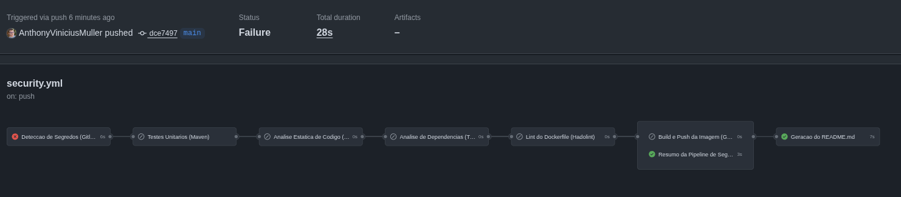
*Execução 1 — `secret-scan` falha e os quatro gates seguintes ficam pulados. O `build-and-push` não executa.*

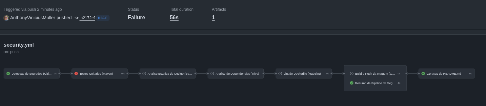
*Execução 2 — com o segredo tratado, o primeiro gate passa e a falha avança para os testes unitários.*

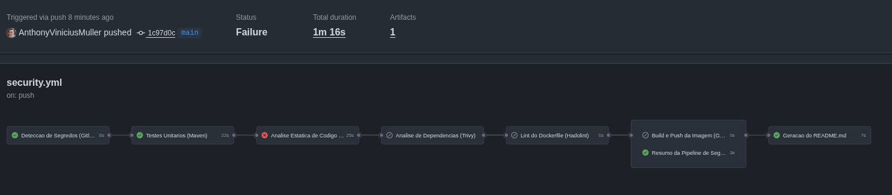
*Execução 3 — testes corrigidos, falha agora no SAST.*

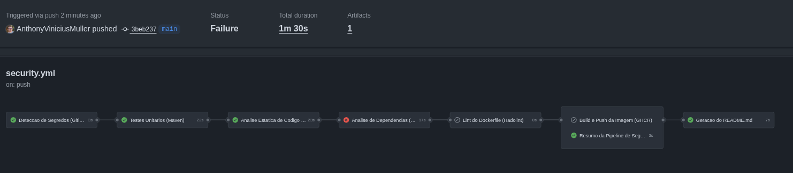
*Execução 4 — SQL Injection corrigida, falha agora na análise de dependências.*

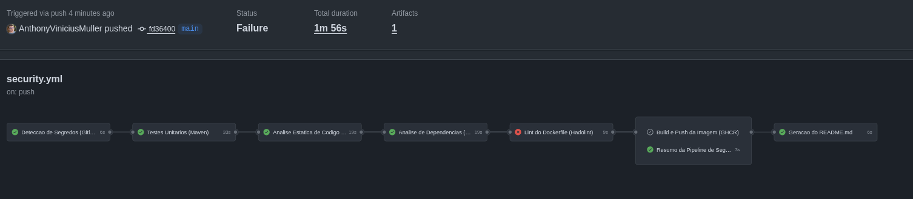
*Execução 5 — dependências atualizadas, resta o lint do Dockerfile.*

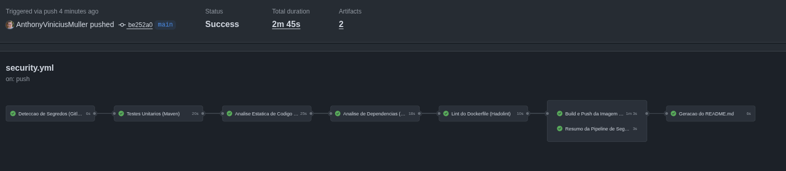
*Execução 6 — pipeline totalmente verde, com o `build-and-push` executando pela primeira vez.*

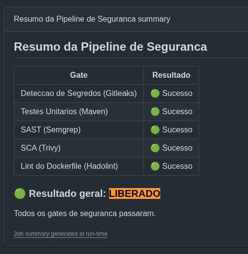
*Resumo publicado na aba Summary da execução final: os cinco gates com Sucesso e o veredito LIBERADO.*

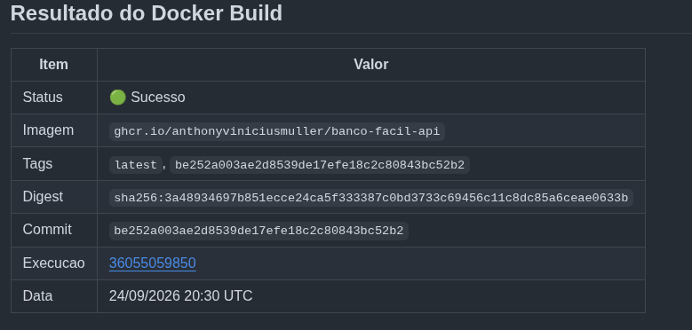
*README gerado pela pipeline, com o resultado do build da imagem.*

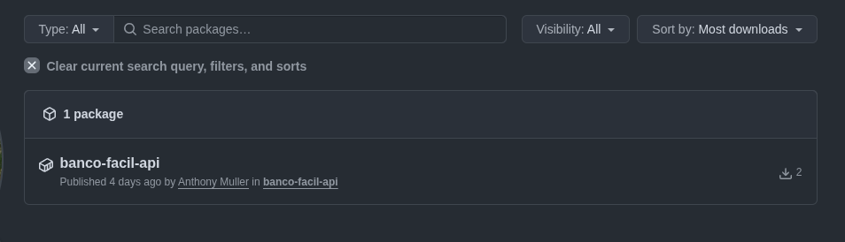
*Aba Packages do repositório.*

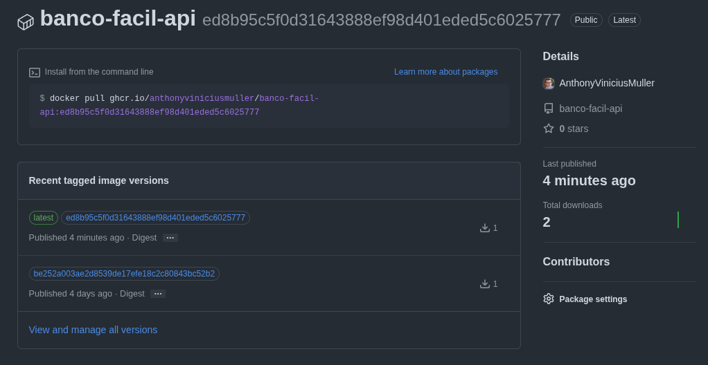
*Imagem publicada em `ghcr.io/anthonyviniciusmuller/banco-facil-api`, com as tags `latest` e o SHA do commit.*

---

# Parte 3 — Discussão final

Três dos cinco gates são exclusivamente Shift Left, porque seu insumo é o artefato estático e ele não muda depois do deploy: o SAST, que não teria nada de novo para examinar em produção; os testes unitários, que barraram o erro de integridade antes de existir artefato; e o lint do Dockerfile, que avalia instruções de build, irrelevantes depois que a imagem existe.

Os outros dois só cobrem metade do problema se ficarem no CI. A detecção de segredos impede a entrada de novos segredos, mas à direita o que importa é o ciclo de vida da credencial em uso: rotação automática pelo cofre, alerta de uso a partir de origem ou horário anômalo, revogação imediata. O SCA é o caso mais claro — atualizar o Spring Boot e remover o log4j resolveu o inventário de hoje, mas o gate avalia o mundo no dia do commit, e o Log4Shell provou que um artefato aprovado em 8 de dezembro de 2021 estava crítico no dia 9. O mesmo Trivy rodando periodicamente sobre as imagens já publicadas no GHCR é um controle de Shift Right.

Para fechar o ciclo, faltariam cinco coisas. A Branch Protection na `main` exigindo os cinco checks, que é a mais barata: enquanto houver push direto, a pipeline é uma recomendação. SBOM por artefato implantado com reavaliação contínua contra novas CVEs, que transforma "onde nós usamos isso?" de semanas de arqueologia em uma consulta. DAST em staging e depois em produção sob janela controlada, porque nenhum gate atual enxerga configuração de ambiente nem autorização quebrada — o `/conta?id=` está a salvo de injeção agora, mas continua sem verificar se o usuário autenticado pode ler aquela conta, e esse IDOR é invisível para SAST. Observabilidade com detecção de exploração, que dá resposta na janela entre a divulgação de uma CVE e o deploy da correção. E liberação progressiva com rollback automatizado, que limita o raio de impacto.

A pipeline garante que a BancoFácil não reintroduza os problemas que já conhece. Não garante que ela saiba o que está rodando em produção, nem que perceba quando o que está rodando se torna vulnerável. O incidente da chave exposta foi resolvido à esquerda; o próximo — uma CVE publicada depois do deploy, ou uma falha de autorização que nenhum scanner estático enxerga — só será detectado à direita.
