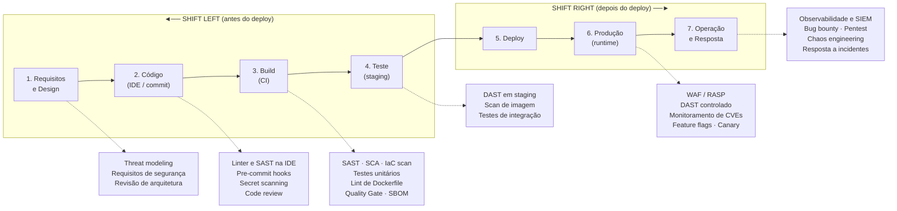

# Parte 1 — Pesquisa Teórica

**Disciplina:** Segurança da Informação — Unifebe
**Tema:** Shift Left e Shift Right em pipelines de CI/CD
**Estudo de caso:** BancoFácil Digital

---

## 1. Shift Left vs. Shift Right

### 1.1 O que significa "mover para a esquerda" e "para a direita"

A metáfora nasce de uma convenção gráfica: quando desenhamos o ciclo de vida de desenvolvimento de software (SDLC) como uma linha do tempo horizontal, o tempo corre da esquerda para a direita — requisitos e design ficam à esquerda, produção e operação ficam à direita. **Shift Left** é, literalmente, antecipar atividades de verificação para as fases mais à esquerda dessa linha, ou seja, executá-las o mais cedo possível. **Shift Right** é o movimento oposto e complementar: levar verificação, experimentação e observabilidade *para depois do deploy*, tratando a produção como um ambiente legítimo de teste — sob controle.

É importante notar que o termo não nasceu na segurança. Ele vem do movimento de testes ágeis (Larry Smith, "Shift-Left Testing", *Dr. Dobb's*, 2001), onde significava antecipar o teste em relação à codificação. A comunidade de segurança adotou o vocabulário nos anos 2010, junto com a consolidação do DevSecOps, para descrever a mesma ideia aplicada a controles de segurança. O Shift Right é ainda mais recente e vem da cultura SRE/Chaos Engineering: se o sistema distribuído real é irredutivelmente diferente de qualquer ambiente de teste, então parte da validação só pode acontecer em produção.

### 1.2 Linha do tempo do SDLC com os dois movimentos

*Diagrama autoral. A fronteira entre os dois movimentos é o deploy: tudo que acontece antes dele é prevenção; tudo que acontece depois é detecção e contenção no ambiente real.*

A pipeline implantada na Parte 2 ocupa exatamente as caixas 2, 3 e 4 do diagrama: os cinco gates (`secret-scan`, `unit-tests`, `sast`, `sca`, `dockerfile-lint`) rodam entre o commit e o deploy, e o `build-and-push` — o deploy propriamente dito — só é alcançado quando todos passam.

### 1.3 Três controles de cada lado

**Shift Left**

| Controle | Por que é Shift Left |
|---|---|
| **SAST** (análise estática de código) | Opera sobre o código-fonte ou bytecode; não precisa da aplicação rodando, então pode ser executado no editor do desenvolvedor, no pre-commit ou no CI — antes de existir qualquer artefato implantado. |
| **Detecção de segredos** (Gitleaks, push protection) | Age sobre o repositório Git. Quanto mais cedo dispara, menor o custo: um hook local impede o commit; um scan no CI impede o merge; descobrir depois exige rotação da credencial. |
| **SCA** (análise de dependências) | O `pom.xml` / `package.json` já existe no momento do commit. Bloquear no CI a entrada de uma biblioteca vulnerável é muito mais barato do que removê-la de 40 microsserviços já implantados. |

**Shift Right**

| Controle | Por que é Shift Right |
|---|---|
| **DAST / pentest contra produção ou staging idêntico a produção** | Exige aplicação em execução, com a configuração, o proxy reverso e as integrações reais. Só uma instância implantada expõe essa superfície. |
| **Observabilidade e detecção de anomalias (SIEM, WAF, RASP)** | Consome sinais que só existem quando há tráfego real de usuários — e de atacantes. Nenhum teste prévio produz esse dado. |
| **Deploy progressivo (feature flags, canary, blue/green)** | É um controle de segurança *de liberação*: reduz o raio de impacto de uma alteração e permite reverter em minutos. Só faz sentido depois que o código está em produção. |

O critério de classificação, portanto, não é "quem executa" nem "qual ferramenta", mas **de qual insumo o controle depende**: se o insumo é o artefato estático (código, manifesto, imagem), o controle pode ser antecipado; se o insumo é o comportamento do sistema em execução sob carga real, ele necessariamente pertence à direita.

### 1.4 Concorrentes ou complementares?

São **complementares**, e tratá-los como alternativas é um erro conceitual com consequências práticas. Shift Left reduz a *probabilidade* de a falha chegar à produção; Shift Right reduz o *impacto* e o *tempo de detecção* daquelas que chegam mesmo assim. São camadas distintas da mesma defesa em profundidade.

Existem classes inteiras de vulnerabilidade que, por definição, escapam do melhor pipeline de Shift Left:

* **Falhas de configuração de ambiente.** Um bucket de objetos aberto para leitura pública, uma variável `SPRING_PROFILES_ACTIVE=dev` deixada no manifesto de produção habilitando o Actuator sem autenticação, um security group liberando 0.0.0.0/0. O código é idêntico ao que passou em todos os gates; o defeito está na configuração do ambiente de destino.
* **Falhas de lógica de negócio / autorização quebrada.** O SAST não sabe que o endpoint `/conta?id=` da BancoFácil *deveria* restringir o acesso à conta do próprio usuário autenticado. Sintaticamente o código está correto; semanticamente ele é um IDOR (*Broken Object Level Authorization*, item nº 1 do OWASP API Security Top 10). Só um teste dinâmico com dois usuários reais, ou um relato de bug bounty, revela isso.
* **CVEs publicadas depois do deploy.** É o caso canônico e o mais didático. Em 9 de dezembro de 2021, a BancoFácil poderia ter todo o pipeline verde: o `log4j-core 2.14.1` não tinha nenhum alerta em nenhuma base pública no dia do merge. A CVE-2021-44228 nasceu *depois*, e a versão já implantada virou retroativamente crítica. Nenhuma quantidade de Shift Left teria evitado isso — o que resolve é o lado direito: inventário atualizado (SBOM), monitoramento contínuo do inventário contra novas CVEs, e regra de WAF/detecção para o padrão de exploração enquanto a correção não é implantada.

**Exemplo concreto de vulnerabilidade só detectável à direita:** um vazamento de memória lento no pool de conexões que só se manifesta após ~72 horas de tráfego real, levando à exaustão de conexões e à indisponibilidade do serviço de pagamentos. É um problema de segurança (disponibilidade é um dos três pilares da tríade CIA), é invisível para SAST/SCA/DAST em pipeline, e só aparece em observabilidade de produção.

### 1.5 Custo de correção por fase — e uma leitura crítica dos números

A intuição é sólida e vale a pena enunciá-la antes dos números: quanto mais tarde um defeito é descoberto, mais artefatos derivados dele já existem (código, testes, documentação, dados migrados, imagens publicadas, integrações de terceiros), e mais pessoas precisam ser envolvidas na correção. Corrigir no design é mudar um diagrama; corrigir em produção é um ciclo completo de incidente: detecção, triagem, correção, testes de regressão, deploy emergencial, comunicação, e possivelmente notificação a reguladores.

Para a BancoFácil, o custo em produção tem componentes que não existem nas fases anteriores:

| Fase | Natureza do custo |
|---|---|
| **Design** | Horas de discussão. O "artefato" a ser refeito é um documento. |
| **Código** | Minutos a horas do próprio autor, com o contexto ainda fresco na cabeça. |
| **Build/CI** | Um novo commit e uma nova execução da pipeline. O feedback ainda chega em minutos, antes do code review. |
| **Teste/staging** | Ciclo de ida e volta entre QA e desenvolvimento, re-planejamento de sprint, possível atraso de release. |
| **Produção** | Tudo do anterior, mais: indisponibilidade ou fraude em curso, plantão, comunicação a clientes, exposição regulatória (LGPD art. 48 obriga a comunicação à ANPD e aos titulares; para uma fintech somam-se as normas do Bacen), dano reputacional e, no caso de credencial vazada, rotação de credencial em todos os sistemas que a consomem. |

**A "regra dos 100x" e por que é preciso desconfiar dela.** A afirmação mais repetida do setor é que corrigir um defeito em produção custa entre 30x e 100x o custo de corrigi-lo na fase de requisitos. Ela costuma ser atribuída a três fontes:

1. **Boehm, *Software Engineering Economics* (1981)** — esta é a origem legítima da curva. Boehm mediu projetos reais dos anos 1970, mas eram projetos grandes, em cascata, de organizações como TRW e IBM, com ciclos de release medidos em anos. A curva descreve *aquele* contexto.
2. **O "IBM System Sciences Institute"**, fonte do gráfico de barras 1x/6.5x/15x/100x que circula em centenas de apresentações. Laurent Bossavit, em *The Leprechauns of Software Engineering* (2015), tentou rastreá-lo e não encontrou nenhum artigo primário — nem evidência de que tal instituto tenha publicado o estudo. É uma citação circular: cada texto cita outro texto secundário.
3. **O relatório NIST/RTI "The Economic Impacts of Inadequate Infrastructure for Software Testing" (Planning Report 02-3, 2002)**, que estimou em cerca de US$ 59,5 bilhões anuais o custo de testes inadequados na economia americana. É um estudo sério, mas trata de custo macroeconômico agregado — não valida o multiplicador de 100x para um defeito individual.

A leitura crítica honesta é: **a direção da curva é bem sustentada; a magnitude não é.** Em um contexto de entrega contínua, com deploy várias vezes ao dia e rollback automatizado, a distância econômica entre "corrigir no CI" e "corrigir em produção" é muito menor do que era em 1981 — e esse encurtamento é, aliás, o argumento central do próprio Shift Right. O motivo pelo qual o mercado investe em Shift Left continua válido sem precisar do número inflado, e pode ser defendido por três argumentos verificáveis:

* **Custo de contexto.** Correções feitas minutos após escrever o código aproveitam o modelo mental ainda carregado do autor; dias depois, é preciso reconstruí-lo.
* **Custo de propagação.** Em uma arquitetura com 40 microsserviços, uma dependência vulnerável que passa pelo gate se replica por dezenas de repositórios e imagens.
* **Custo irreversível.** Um segredo exposto em repositório público não pode ser "descommitado": desde o instante da exposição, deve ser considerado comprometido. Nenhuma correção posterior desfaz isso — e é exatamente o que aconteceu com a BancoFácil.

---

## 2. Gestão de Segredos

### 2.1 Secret Sprawl

*Secret Sprawl* é a proliferação descontrolada de credenciais por sistemas, repositórios e ferramentas que não foram projetados para guardá-las, a ponto de a organização perder a resposta para três perguntas básicas: **quais segredos existem, onde cada um está e quem tem acesso a ele.** O termo é usado com frequência pela GitGuardian, que publica anualmente o relatório *State of Secrets Sprawl*; as edições recentes reportam mais de dez milhões de novos segredos detectados por ano apenas em commits de repositórios públicos do GitHub — uma ordem de grandeza que mostra que o problema é sistêmico, não um descuido individual.

As formas mais comuns de vazamento:

* **Commits "temporários" que nunca são revertidos** — exatamente o caso da BancoFácil. Um valor colocado para testar localmente, commitado por engano junto com o resto, e esquecido.
* **Histórico do Git.** É a armadilha mais mal compreendida. Remover o segredo do arquivo e commitar a remoção **não o remove do repositório**: ele continua acessível em `git log -p`, em qualquer clone, em qualquer fork e, no GitHub, muitas vezes ainda alcançável por SHA mesmo após a remoção do branch. Por isso o Gitleaks varre o histórico inteiro, e não apenas o *working tree*.
* **Arquivos de configuração versionados** — `application.properties`, `.env`, `config.yml` commitados porque "só têm configuração", com a senha do banco no meio.
* **Imagens Docker.** Instruções `ENV` e `ARG`, arquivos copiados e depois "apagados" em camada posterior (a camada anterior permanece na imagem), e o histórico de build inteiro visível com `docker history`.
* **Logs e telemetria.** Um `logger.debug("request: " + request)` que despeja o cabeçalho `Authorization`, ou um stack trace com a string de conexão completa — que então é replicado para o agregador de logs, o SIEM e o sistema de tickets.
* **Canais laterais**: wikis internas, tickets, mensagens de chat, capturas de tela em documentação, CI logs impressos sem máscara.

### 2.2 Segredos de build/CI vs. segredos de runtime

| | **Segredo de build/CI** | **Segredo de runtime/aplicação** |
|---|---|---|
| Exemplos | `GITHUB_TOKEN` para publicar no GHCR, credencial do registry, token de publicação de pacote, chave de assinatura de artefato | String de conexão do banco, chave de API do provedor de pagamentos, chave de criptografia de dados, credencial do serviço de mensageria |
| Quando é necessário | Durante a execução do workflow, entre o commit e a publicação do artefato | Durante toda a vida do processo em execução, depois do deploy |
| Quem consome | O runner do CI | O contêiner/processo da aplicação |
| Onde deve morar | Cofre do próprio CI (GitHub Actions Secrets/Environments, com OIDC quando possível, evitando credencial de longa duração) | Cofre de segredos com injeção no deploy (Vault, AWS Secrets Manager, Azure Key Vault), nunca na imagem nem no repositório |
| Tempo de vida ideal | Efêmero — idealmente um token emitido para aquela execução e descartado ao fim | Longo, mas com rotação automática programada |

A distinção é operacionalmente importante e foi explicitamente marcada na correção da Parte 2: o `GITHUB_TOKEN` é gerado pelo GitHub para cada execução do workflow, expira ao fim dela e só serve para autenticar no GHCR — **ele não é, e não pode ser, a origem da chave do gateway de pagamentos**, que precisa existir com a aplicação já rodando, muito depois de o workflow ter terminado. Confundir as duas categorias leva ao antipadrão de injetar segredos de runtime como variáveis de build, que é precisamente o que os assa dentro da imagem.

### 2.3 Por que um segredo de runtime não pode viver na imagem

Mesmo com o registry privado, um `ENV API_KEY=...` no Dockerfile é uma má prática por razões independentes:

1. **A imagem não é opaca.** Qualquer pessoa com permissão de *pull* extrai o valor com `docker history`, `docker inspect` ou simplesmente descompactando as camadas. Não há criptografia em repouso dentro da camada.
2. **Camadas são imutáveis e cumulativas.** Copiar um arquivo com credencial e removê-lo em um `RUN rm` posterior não apaga nada: a camada onde o arquivo existe continua na imagem e no histórico de build.
3. **A imagem circula muito além do registry.** Ela é copiada para o cache de cada nó do cluster, para máquinas de desenvolvedores, para registries espelho, para sistemas de varredura e, eventualmente, para backups. Cada cópia é uma nova superfície de exposição.
4. **Acoplamento ambiente–artefato.** Com o segredo dentro, a mesma imagem não pode ser promovida de staging para produção, quebrando o princípio *build once, deploy anywhere*: ou se constrói uma imagem por ambiente (multiplicando o risco), ou se usam credenciais de produção em staging.
5. **Rotação vira redeploy.** Trocar uma credencial passa a exigir rebuild e republicação da imagem em vez de simplesmente reiniciar o contêiner — o que na prática significa que a rotação não acontece.
6. **Privacidade do repositório não é um controle de segurança suficiente.** Ela reduz o alcance, não o elimina. O caso Uber de 2016 é o exemplo de manual: atacantes obtiveram credenciais de AWS a partir de um repositório **privado** no GitHub acessado com credenciais de funcionários, e as usaram para alcançar dados de 57 milhões de usuários. "É privado" é uma hipótese sobre o controle de acesso de terceiros, não uma propriedade do segredo.

O NIST SP 800-190 (*Application Container Security Guide*) trata o ponto diretamente ao recomendar que segredos sejam armazenados fora das imagens e fornecidos em tempo de execução pelo orquestrador.

### 2.4 Duas categorias de ferramenta com propósitos diferentes

**Detecção (encontrar segredos onde não deveriam estar):**

* **Gitleaks** — binário Go, sem dependência de serviço externo, usado na pipeline desta atividade. Combina ~150 regras de regex por provedor com verificação de entropia de Shannon, varre o histórico completo (`gitleaks detect`) ou apenas o diff (`gitleaks protect`), e suporta *allowlisting* por `.gitleaksignore` (fingerprint exato) ou `.gitleaks.toml` (regex).
* **TruffleHog** — diferencial importante: além de detectar o padrão, faz **verificação ativa** (*credential verification*), chamando a API do provedor para determinar se aquela chave ainda é válida. Isso reduz drasticamente o ruído de falsos positivos e ajuda a priorizar: um segredo *verificado como ativo* é um incidente; um padrão que não autentica é dívida técnica.
* **GitHub Secret Scanning** — nativo da plataforma, com dois modos distintos: o *scanning* retroativo, que varre o que já existe, e a **push protection**, que rejeita o push no momento em que ele ocorre. Esta última é o exemplo mais puro de Shift Left possível: o segredo nunca chega a existir no servidor. O GitHub também tem um programa de parceria com provedores (AWS, Stripe, Slack e outros): ao detectar um padrão conhecido em repositório público, ele **notifica o emissor**, que pode revogar a chave automaticamente.

**Gerenciamento centralizado (guardar e servir segredos de forma controlada):**

* **HashiCorp Vault** — cofre com controle de acesso por política, auditoria de cada leitura, *dynamic secrets* (gera uma credencial de banco sob demanda, com TTL curto, e a revoga na expiração) e *leasing*/renovação.
* **AWS Secrets Manager** — integrado ao IAM e ao KMS, com rotação automática nativa via função Lambda e versionamento de cada segredo.
* **Azure Key Vault** — equivalente no ecossistema Microsoft, com suporte a HSM e integração com Managed Identities.
* **GitHub Actions Secrets/Environments** — cofre restrito ao escopo de CI: valores criptografados, mascarados automaticamente nos logs, com aprovação manual opcional por *environment*. Adequado para segredos de build; insuficiente como cofre de runtime, porque não tem rotação, nem leasing, nem canal de entrega para a aplicação implantada.

**A diferença de propósito** é a de um alarme de incêndio para um cofre de banco. A detecção é um controle **reativo/detectivo**: assume que a falha pode ocorrer e a encontra rapidamente. O gerenciamento é um controle **preventivo**: elimina a razão para o segredo estar no código em primeiro lugar. Só a segunda categoria resolve o problema; a primeira existe porque a primeira categoria nunca será perfeita. Um programa maduro usa as duas, em profundidade: cofre para guardar, hook local para impedir, scanner no CI para verificar, push protection na plataforma como última barreira.

### 2.5 Rotação de segredos

*Secret rotation* é a substituição periódica e controlada de uma credencial por uma nova, com invalidação da anterior no sistema que a emitiu. Em regime normal, é uma prática preventiva: limita a janela de utilidade de um segredo que tenha vazado sem que ninguém perceba. Em resposta a incidente, é **a única ação que efetivamente encerra a exposição**.

O raciocínio é simples e vale enunciar com clareza, porque é a lição central do incidente da BancoFácil: **remover o segredo do código altera o que está publicado a partir de agora; não altera o que já foi lido.** A chave do gateway de pagamentos ficou seis meses em um repositório público. Nesse período ela pôde ser clonada, indexada por buscadores de código, coletada por bots que varrem o GitHub em tempo real e arquivada por terceiros. Deletar o arquivo, reescrever o histórico com `git filter-repo` e forçar o push não invalidam nenhuma dessas cópias. Enquanto a credencial continuar válida no provedor de pagamentos, quem a copiou continua podendo usá-la.

Por isso a ordem correta de resposta é: **(1) rotacionar** — emitir nova credencial e revogar a antiga no provedor; **(2) auditar** — examinar os logs do provedor em busca de uso da credencial antiga a partir de origens não reconhecidas, para dimensionar se houve exploração; **(3) remover do código** e ajustar a aplicação para ler do cofre; **(4) opcionalmente, reescrever o histórico**, medida de higiene que só faz sentido depois da rotação e que tem custo alto (invalida todos os clones e forks); **(5) corrigir a causa raiz**, adicionando o controle que teria impedido o commit (push protection, pre-commit hook, gate no CI).

Na Parte 2 desta atividade, as chaves plantadas são valores de exemplo públicos, documentados pelos próprios fornecedores, que nunca foram credenciais válidas. Por isso a etapa (1) não se aplica e a (4) seria desproporcional: o tratamento correto ali é o reconhecimento explícito dos achados por fingerprint no `.gitleaksignore` — uma decisão de aceitação de risco documentada, que é diferente de simplesmente desligar o gate.

---

## 3. Proteção e Qualidade

### 3.1 Branch Protection

*Branch Protection* é o conjunto de regras que a plataforma (GitHub, GitLab) aplica **do lado do servidor** sobre um branch, restringindo quem pode alterá-lo e sob quais condições. A característica decisiva é ser server-side: diferentemente de um hook local, que cada desenvolvedor pode desabilitar ou simplesmente não instalar, a regra é avaliada no momento do push/merge pela plataforma, e não há como contorná-la a partir da máquina do desenvolvedor.

Regras tipicamente configuráveis no GitHub:

1. **Exigir pull request antes do merge** — proíbe push direto no branch protegido.
2. **Exigir um número mínimo de aprovações** — com a variante *dismiss stale approvals*, que anula aprovações quando novos commits são adicionados, e *require review from Code Owners*, que exige aprovação de quem é dono daquele diretório (via `CODEOWNERS`).
3. **Exigir checks de status aprovados** — a integração direta com o CI: os jobs escolhidos precisam estar verdes. É esta regra que converte a pipeline em *gate* de verdade.
4. **Exigir que o branch esteja atualizado com a base** antes do merge, evitando o *semantic merge conflict* em que duas alterações individualmente verdes quebram quando combinadas.
5. **Proibir force-push e proibir deleção do branch** — preserva a integridade e a auditabilidade do histórico.
6. **Exigir conversas de revisão resolvidas**, **exigir commits assinados (GPG/SSH)**, **exigir histórico linear**, e **aplicar as regras também a administradores** (*Do not allow bypassing*) — sem esta última, a regra vira uma recomendação para quem tem permissão de admin.

No GitLab o mecanismo equivalente combina *Protected Branches* com *Merge Request Approval Rules* e *Merge Checks*.

### 3.2 Quality Gate

*Quality Gate* é um conjunto de condições objetivas, avaliadas automaticamente, que um artefato precisa satisfazer para avançar de estágio — e cuja reprovação **interrompe o fluxo**. O conceito é formalizado no SonarQube, onde um Quality Gate é uma lista de condições sobre métricas (por exemplo: "zero vulnerabilidades de severidade *blocker* em código novo", "cobertura de código novo ≥ 80%", "densidade de código duplicado < 3%") cujo resultado é binário: *Passed* ou *Failed*.

A diferença em relação a um relatório é **autoridade, não informação**. Ambos produzem exatamente o mesmo conhecimento; o gate acrescenta uma consequência. Três diferenças práticas decorrem disso:

* **Binaridade.** O relatório diz "foram encontrados 47 problemas"; o gate diz "reprovado". O gate obriga a organização a definir antecipadamente qual é o limiar aceitável — uma decisão de risco que o relatório permite adiar indefinidamente.
* **Mecânica de bloqueio.** Tecnicamente, é o código de saída do processo. O `--error` do Semgrep e o `exit-code: '1'` do Trivy, usados nesta atividade, são exatamente o que transforma análise em gate: sem eles, a ferramenta imprime os mesmos achados e o job termina verde.
* **Resistência à erosão.** Relatórios sofrem de fadiga de alerta: uma lista que cresce sem consequência é racionalmente ignorada pela equipe. O gate impede que a dívida cresça silenciosamente, ao custo de exigir um processo explícito de exceção (o `.gitleaksignore` desta atividade é justamente isso: uma exceção nomeada, versionada e revisável — e não uma flag global que desliga a verificação).

Vale registrar a condição necessária: um gate só é sustentável se tiver baixa taxa de falso positivo e feedback rápido. Um gate ruidoso é desativado pela equipe em semanas, e o resultado final é pior do que não ter gate nenhum, porque cria uma falsa sensação de cobertura.

### 3.3 O papel dos testes unitários na segurança

Além da corretude funcional, os testes unitários cumprem quatro papéis de segurança:

* **Muitos defeitos de segurança são defeitos de corretude.** A fronteira é menos nítida do que parece: um off-by-one é um buffer overflow em C; um erro de arredondamento em cálculo financeiro é uma falha de integridade, explorável em escala (o clássico *salami slicing*). O bug plantado nesta atividade — `applyDiscount` dividindo por 1000 em vez de 100 — é apresentado como bug funcional, mas em uma fintech é uma falha de integridade de transação financeira. Quem o detectou foi o teste unitário, não o SAST.
* **Codificam invariantes de segurança como regressão executável.** Depois de corrigir a SQL Injection, o teste que verifica que `buscarConta("1' OR '1'='1")` não retorna todas as contas impede que a falha volte em um refactor futuro. Toda correção de vulnerabilidade deveria vir acompanhada do teste que a trava.
* **Testam os caminhos de erro, que é onde as falhas moram.** O caminho feliz costuma ser bem exercitado manualmente; o comportamento com entrada nula, negativa, gigante, malformada ou em encoding inesperado quase nunca é. É exatamente aí que se concentram as vulnerabilidades de validação de entrada.
* **Viabilizam a correção rápida.** A capacidade de aplicar um patch de segurança em horas depende inteiramente da confiança de que a alteração não quebrou o resto. Sem suíte de testes, a atualização emergencial do `log4j` compete com o medo de causar uma indisponibilidade — e frequentemente perde.

**Cobertura e superfície de risco** relacionam-se de forma real, porém indireta e assimétrica. Baixa cobertura é um forte indicador de risco: código não exercitado é código cujo comportamento sob entrada inesperada é desconhecido. Mas alta cobertura **não** implica baixo risco, porque a cobertura de linha mede apenas se a linha foi *executada*, não se o comportamento foi *verificado* — é trivial atingir 90% com testes sem asserção significativa. Além disso, as classes de vulnerabilidade mais graves (autorização quebrada, erro de lógica de negócio, falha de configuração) não são capturadas por cobertura de jeito nenhum. A leitura correta é: use a cobertura como alarme para o que está abaixo do piso, não como certificado do que está acima dele.

### 3.4 As três práticas como primeira linha de defesa

Branch Protection, Quality Gates e testes unitários formam a primeira linha porque, juntos, estabelecem as três precondições sem as quais nenhuma ferramenta especializada produz efeito:

* **Branch Protection cria o ponto de controle.** Sem ela, existe um caminho que contorna a pipeline: o push direto na `main`. Uma pipeline que pode ser contornada não é um controle, é uma sugestão. É a Branch Protection que garante que *todo* código passe pelo mesmo funil — e é por isso que o item 7 da Parte 2, ainda que marcado como opcional, é conceitualmente o que fecha o desenho.
* **Quality Gates dão consequência ao achado.** Sem o bloqueio, SAST, SCA e secret scanning produzem relatórios que ninguém lê. A ferramenta mais cara do mercado, configurada em modo informativo, tem exatamente o mesmo efeito prático que nenhuma ferramenta.
* **Testes unitários fornecem a rede de segurança que torna a correção barata.** São eles que transformam "temos que atualizar o log4j" de um projeto de risco em uma tarefa de meia hora.

Há ainda um argumento de custo-benefício que justifica a ordem: essas três práticas são **baratas, determinísticas e praticamente sem falso positivo**. Um teste que falha, falha de verdade; um push direto bloqueado é objetivamente um push direto. Ferramentas de segurança especializadas são estatísticas por natureza: emitem falsos positivos, exigem tunning e consomem tempo de triagem. Começar por elas em uma organização que ainda permite push direto na `main` é investir no controle caro antes do controle barato — e é assim que programas de DevSecOps perdem a adesão das equipes. A sequência da pipeline desta atividade reflete essa lógica: os gates mais baratos e determinísticos (segredos, testes) rodam primeiro, e os mais caros (SAST, SCA) só são alcançados depois.

---

## 4. Análise de Segurança: SAST, DAST e SCA

### 4.1 SAST

**SAST** (*Static Application Security Testing*) é a análise do código **sem executá-lo**, em busca de padrões associados a vulnerabilidades. É a versão automatizada e escalável da revisão de código orientada a segurança, e é classificada como técnica de caixa-branca: tem acesso à estrutura interna completa do programa.

Dependendo da ferramenta, o insumo é o **código-fonte** (Semgrep, que casa padrões sobre a árvore sintática; SonarQube), o **bytecode/IR compilado** (SpotBugs com FindSecBugs; ferramentas comerciais que fazem análise de fluxo de dados sobre bytecode Java) ou ambos. Análises mais sofisticadas fazem *taint analysis*: rastreiam o fluxo de dados de uma origem não confiável (*source* — por exemplo, o `@RequestParam String id` do `AccountController`) até uma operação sensível (*sink* — o `Statement.executeQuery`), e reportam o caminho quando não há sanitização no meio. Foi exatamente esse o achado de SQL Injection nesta atividade.

**Quando roda:** o mais cedo possível — plugin na IDE, pre-commit hook, e no CI logo após o commit. Não depende de build completo nem de ambiente implantado, o que o torna o controle de segurança mais barato de operar e o mais "à esquerda" de todos os que analisam código.

### 4.2 DAST

**DAST** (*Dynamic Application Security Testing*) testa a aplicação **em execução**, enviando requisições do lado de fora e analisando as respostas. É caixa-preta: não conhece o código, apenas a interface exposta. O OWASP ZAP e o Burp Suite são os representantes típicos; o fluxo padrão é *spider*/crawl para mapear a superfície, seguido de *active scan*, que injeta cargas maliciosas (payloads de XSS, SQLi, path traversal) e observa o comportamento.

**Por que exige a aplicação rodando:** porque o objeto de teste do DAST não é o código, é o **sistema completo em execução** — a aplicação mais o servidor de aplicação, o proxy reverso, o WAF, a configuração de TLS, os cabeçalhos de segurança, a sessão, o banco de dados e as integrações. Boa parte do que o DAST encontra sequer está no código-fonte: um cookie sem `HttpOnly` definido no servidor, um método HTTP habilitado por padrão no Tomcat, um cabeçalho `Server` expondo a versão, um certificado expirado. Nada disso é visível estaticamente.

**Como isso muda o momento no pipeline:** o DAST só pode entrar **depois** de um estágio de deploy. Na prática, isso significa CD, não CI: a pipeline precisa publicar em um ambiente efêmero ou em staging, esperar a aplicação ficar saudável, rodar o scan e só então prosseguir. O custo é assimétrico em relação ao SAST — um scan ativo completo leva de dezenas de minutos a horas, contra segundos do SAST —, razão pela qual é comum executá-lo em cadência noturna ou por release, e não a cada commit. Há ainda um cuidado operacional: *active scan* escreve dados e pode disparar efeitos colaterais reais (criar registros, enviar e-mails, processar cobranças), o que exige ambiente descartável ou escopo cuidadosamente restrito.

### 4.3 SCA

**SCA** (*Software Composition Analysis*) inventaria os componentes de terceiros do projeto — dependências diretas e, crucialmente, **transitivas** — e confronta esse inventário com bases públicas de vulnerabilidades (NVD, OSV, GitHub Advisory Database) e com as licenças declaradas. O produto central do SCA moderno é o **SBOM** (*Software Bill of Materials*), nos formatos CycloneDX ou SPDX: a lista completa e versionada de tudo que compõe o artefato. A Ordem Executiva americana 14028 (maio de 2021) tornou o SBOM requisito para fornecedores do governo federal, o que acelerou sua adoção no mercado.

A motivação é aritmética: em uma aplicação Java típica, a fração do bytecode implantado que foi escrita pela própria equipe raramente passa de alguns por cento. O `spring-boot-starter-web` desta atividade traz dezenas de artefatos que ninguém declarou explicitamente. Analisar apenas o código próprio é auditar a minoria do que roda em produção.

**Log4Shell (CVE-2021-44228)** é o caso que consolidou o SCA como controle obrigatório, e vale destrinchar por que ele é tão didático. Divulgada em 9 de dezembro de 2021, com CVSS 10.0, a falha estava no `log4j-core` (versões 2.0-beta9 a 2.14.1 — exatamente a versão plantada nesta atividade): o mecanismo de *lookup* JNDI interpretava uma expressão `${jndi:ldap://...}` presente em uma **mensagem de log** e carregava código remoto a partir dela. Bastava que um dado controlado pelo atacante — um cabeçalho `User-Agent`, um campo de formulário, um nome de usuário em tentativa de login — chegasse a qualquer chamada de log para haver execução remota de código.

Três lições que o caso ensinou, todas relevantes para a BancoFácil:

1. **O inventário é o controle.** No dia 10 de dezembro, a pergunta que travou milhares de empresas não foi "como corrigir", que era trivial, mas "**onde nós usamos isso?**". Organizações com SBOM atualizado responderam em horas; as demais levaram semanas de arqueologia. Com 40 microsserviços, a BancoFácil está exatamente nessa situação.
2. **Dependências transitivas dominam.** A esmagadora maioria das aplicações afetadas nunca declarou `log4j-core` no seu build: ele chegou através de outra dependência, alguns níveis abaixo.
3. **A janela de exposição é retroativa.** Todo artefato implantado antes de 9/12/2021 era seguro segundo qualquer scanner do dia anterior e vulnerável no dia seguinte, sem nenhuma alteração de código. É o argumento definitivo para o monitoramento contínuo de Shift Right — e também por que o número de dependências importa por si só: cada dependência não utilizada, como o `gson` removido na Parte 2, é uma aposta desnecessária em CVEs futuras.

### 4.4 Tabela comparativa

| | **SAST** | **DAST** | **SCA** |
|---|---|---|---|
| **O que analisa** | Código-fonte e/ou bytecode do código próprio; estrutura e fluxo de dados internos | A aplicação em execução vista de fora: requisições, respostas, configuração de servidor e infraestrutura | Manifestos de dependência (`pom.xml`, lockfiles), jars empacotados e camadas de imagem — o código de terceiros |
| **Caixa** | Branca | Preta (ou cinza, com credenciais de teste) | Branca (inventário declarativo) |
| **Quando roda** | IDE, pre-commit, CI logo após o commit. Não exige build nem deploy | Após um deploy: ambiente efêmero, staging ou produção controlada. Tipicamente noturno ou por release | CI a cada commit **e** continuamente sobre o inventário do que já está implantado |
| **Ferramentas** | Semgrep, SonarQube, SpotBugs + FindSecBugs, CodeQL, Checkmarx, Fortify | OWASP ZAP, Burp Suite, Nuclei, Nikto | Trivy, Grype, OWASP Dependency-Check, Dependabot, Renovate, Snyk, Syft (SBOM) |
| **Detecta bem** | Injeção (SQL, comando, LDAP), XSS refletido, path traversal, criptografia fraca, segredos em código, desserialização insegura, uso de APIs perigosas | Falhas de configuração, cabeçalhos de segurança ausentes, cookies sem flags, gestão de sessão, autenticação quebrada, exposição de endpoints administrativos, TLS mal configurado, vulnerabilidades em componentes não previstos no build | CVEs conhecidas em dependências diretas e transitivas, versões fora de suporte, conflitos de licença, pacotes maliciosos/typosquatting |
| **Limitações** | Alta taxa de **falsos positivos** (não conhece o contexto de execução); cego para falhas de lógica de negócio e de autorização; cego para configuração de runtime; requer suporte à linguagem | **Falsos negativos** por cobertura incompleta (não alcança o que o crawler não descobre — SPAs, fluxos autenticados complexos); lento; não aponta o local no código; risco de efeito colateral em dados; exige ambiente implantado | Só conhece vulnerabilidades **já publicadas** (zero-day é invisível); **falso positivo de alcançabilidade** — reporta a CVE mesmo quando o caminho vulnerável nunca é executado pela aplicação; depende da qualidade e do atraso da base de dados |
| **Não detecta** | Erro de configuração de ambiente; IDOR; falha de autorização | Vulnerabilidade em caminho não exercitado; problema de qualidade interna | Nada sobre o código próprio |

Nenhuma das três é substituta das outras: elas têm campos de visão **complementares e quase disjuntos**, e é essa disjunção que justifica manter as três.

### 4.5 Posicionamento na linha Shift Left ↔ Shift Right

**SAST é puramente Shift Left.** Seu insumo é o artefato estático, e não há nenhum ganho em adiá-lo: rodar SAST "em produção" é uma sentença sem significado — ele analisaria o mesmo código que já estava disponível no commit. Quanto mais à esquerda, melhor.

**DAST é o controle dos dois lados.** À esquerda, roda contra um ambiente de staging levantado pela própria pipeline, funcionando como gate antes do deploy. À direita, roda contra produção de forma controlada — janela combinada, escopo restrito, contas de teste, monitoramento durante a execução —, porque só a produção tem a configuração real, o WAF real, os certificados reais e as integrações reais. É comum que um scan encontre em produção exatamente o que passou em staging, e a diferença esteja sempre em configuração de ambiente.

**SCA atua nos dois lados, e essa é a parte contraintuitiva.** À esquerda, é um gate de entrada: impede que uma dependência vulnerável seja introduzida. Mas o gate de entrada tem uma limitação estrutural — ele avalia o mundo **no dia do commit**. Como novas CVEs são publicadas continuamente, um artefato aprovado hoje pode estar crítico amanhã sem que uma única linha mude. Log4Shell é a demonstração histórica: todo pipeline do mundo estava verde em 8 de dezembro de 2021.

Fechar esse ciclo exige a contraparte à direita, que é onde o SCA deixa de ser um scan e vira um processo contínuo:

* **SBOM persistido por artefato implantado** — para responder "onde usamos X?" em minutos, e não em semanas;
* **reavaliação contínua do inventário do que está em produção** contra as bases de CVE, disparando alerta quando surge uma correspondência nova (é o que fazem o Dependabot/Renovate, os *admission controllers* com política e o monitoramento de registry);
* **capacidade de resposta**: mitigação virtual via WAF e detecção de tentativas de exploração enquanto a correção é construída, testada e implantada.

Resumindo a lógica que atravessa esta seção: **Shift Left garante que não introduzimos o problema conhecido; Shift Right garante que descobrimos o problema que passou a existir depois.**

---

## 5. Infraestrutura e Contêineres

### 5.1 Hardening de Dockerfile

*Hardening* é a redução deliberada da superfície de ataque da imagem e do contêiner: manter o mínimo necessário para a aplicação funcionar, com o mínimo de privilégio, de forma reproduzível e auditável. Cada binário, biblioteca, gerenciador de pacotes e shell presentes na imagem final e não usados pela aplicação são ferramentas gratuitas à disposição de quem conseguir executar código dentro do contêiner.

Más práticas comuns — as seis primeiras estavam no Dockerfile original desta atividade ou são diretamente relacionadas:

1. **Tag `latest` ou ausência de tag** (Hadolint **DL3007**/DL3006). O build deixa de ser reproduzível: a mesma linha produz imagens diferentes em dias diferentes, e uma regressão de segurança na base entra sem nenhuma mudança no repositório. O ideal é fixar por *digest* (`@sha256:...`); no mínimo, uma tag específica e imutável.
2. **Executar como `root`** (**DL3002**). Discutido em 5.2.
3. **Imagem base excessivamente grande.** `openjdk:latest` traz uma distribuição completa com JDK, compilador, `curl`, `wget`, shell e gerenciador de pacotes. Uma `eclipse-temurin:17-jre-alpine` é uma fração disso; `distroless` e `scratch` levam o princípio ao limite, deixando praticamente nada executável além da aplicação.
4. **`ADD` em vez de `COPY`** (DL3020). O `ADD` tem comportamento implícito: baixa URLs remotas e extrai tarballs automaticamente — o que significa buscar código de fora durante o build e descompactar conteúdo potencialmente controlado por terceiros. Use `COPY`, que só copia.
5. **Segredos dentro da imagem** — via `ENV`, `ARG` ou arquivo copiado e "removido" depois. Detalhado em 2.3.
6. **Ausência de multi-stage build**, deixando compilador, Maven, cache `~/.m2` e código-fonte na imagem de produção. Detalhado em 5.3.
7. **Não fixar versões de pacotes instalados** (DL3008/DL3018): `apt-get install -y curl` instala versões diferentes a cada build.
8. **Não limpar o cache do gerenciador de pacotes** na mesma camada (`rm -rf /var/lib/apt/lists/*`) — se a limpeza vier em camada posterior, o conteúdo permanece na imagem.
9. **Copiar o contexto inteiro** com `COPY . .` sem um `.dockerignore`, levando junto `.git` (com todo o histórico, e portanto com os segredos antigos), `.env`, credenciais locais e artefatos de build.
10. **Ausência de `HEALTHCHECK`** e uso da forma *shell* do `CMD`, que faz a aplicação rodar como filha de um shell e não receber corretamente os sinais de término (problema de disponibilidade em rollout/rollback).

### 5.2 Princípio do Menor Privilégio aplicado a contêineres

O PoLP determina que cada sujeito opere com o conjunto mínimo de permissões necessário à sua função, pelo menor tempo possível. Em contêineres, a aplicação é: o processo deve rodar como usuário não-privilegiado, com sistema de arquivos raiz somente leitura, sem *capabilities* desnecessárias (`--cap-drop=ALL`, adicionando de volta apenas o que for indispensável), com `no-new-privileges`, sem `--privileged`, sem montar o socket do Docker e sem compartilhar namespaces do host.

**Por que root no contêiner é risco mesmo quando "a aplicação precisa":** o argumento costuma confundir privilégio de aplicação com privilégio de sistema. Alguns pontos:

* **O root do contêiner é o root do host** (na ausência de *user namespace remapping*, que não é o padrão em boa parte das instalações). O isolamento vem de namespaces, cgroups, capabilities e seccomp — não de uma identidade de usuário diferente. Um contêiner rodando como UID 0 é um processo UID 0 na máquina hospedeira, apenas com a visão restringida.
* **Escape vira comprometimento total.** Uma vulnerabilidade no kernel, no runtime (as CVEs de escape do runc são o exemplo recorrente) ou uma montagem mal configurada transforma um comprometimento de aplicação em comprometimento do nó. Partindo de um usuário não-privilegiado, a mesma cadeia exige um passo adicional de escalonamento.
* **Escalonamento de uma falha menor.** Com root, uma vulnerabilidade de escrita arbitrária permite sobrescrever binários do sistema, instalar pacotes, carregar ferramentas de ataque, modificar configuração e persistir. Sem root, o atacante fica restrito ao que o usuário da aplicação pode tocar.
* **A necessidade quase sempre é contornável.** Os dois casos citados na prática são portas privilegiadas (< 1024) e escrita em diretórios do sistema. Ambos têm solução padrão: usar porta alta (8080, como nesta atividade) e deixar o mapeamento de porta para o orquestrador; e ajustar a propriedade dos diretórios necessários no build (`--chown`) em vez de elevar o processo. A "necessidade de root" costuma ser, na verdade, a conveniência de não ajustar permissões.
* **Defesa em profundidade.** O contêiner não-root não impede a invasão inicial; ele aumenta o custo do próximo passo. É essa diferença que separa um incidente contido de um comprometimento do cluster.

O NIST SP 800-190 e o CIS Docker Benchmark tratam a execução não-root como controle de linha de base, e o Kubernetes oferece a contraparte declarativa no `securityContext` (`runAsNonRoot: true`, `readOnlyRootFilesystem: true`, `allowPrivilegeEscalation: false`), aplicável por política de admissão.

### 5.3 Multi-stage build

O *multi-stage build* usa vários `FROM` no mesmo Dockerfile. Cada `FROM` inicia um estágio independente, e o estágio final copia seletivamente do anterior com `COPY --from=<estágio>`. **Só o último estágio vira a imagem publicada**; todo o resto é descartado.

O Dockerfile corrigido nesta atividade ilustra o padrão: o primeiro estágio parte de `maven:3.9-eclipse-temurin-17`, resolve dependências e compila; o segundo parte de `eclipse-temurin:17-jre-alpine` e copia apenas o `.jar` resultante.

**Redução da superfície de ataque.** A imagem final não contém Maven, JDK, compilador, `git`, o código-fonte, o cache `~/.m2` (com todas as dependências baixadas, incluindo as de teste) nem credenciais eventualmente usadas para acessar um repositório privado de artefatos. Isso importa por dois motivos distintos: menos componentes significam menos CVEs no relatório do Trivy e menos manutenção; e, em caso de comprometimento, o atacante não encontra um compilador nem um gerenciador de pacotes para construir o próximo estágio do ataque — a técnica de *living off the land* fica sem terra.

**Redução de tamanho.** A diferença típica em Java é de uma ordem de grandeza (imagem de build na casa de centenas de megabytes contra dezenas na final). O ganho não é só estético: imagens menores sobem mais rápido para o registry, descem mais rápido em cada nó durante um rollout — o que encurta diretamente o tempo de resposta a um incidente que exija redeploy emergencial — e ocupam menos cache nos nós.

**Ganho adicional de reprodutibilidade.** Com o build acontecendo dentro do primeiro estágio, a compilação deixa de depender do que está instalado na máquina de quem faz o build ou no runner. Por isso o passo "Empacotar aplicação" do workflow pôde ser removido: ele se tornou redundante.

### 5.4 Ferramentas

**Linting de Dockerfile — Hadolint.** Escrito em Haskell, analisa o Dockerfile estaticamente contra um catálogo de regras (`DL****`) e embute o ShellCheck para validar também os comandos dentro de cada `RUN` — um `RUN` com pipe sem `set -o pipefail`, por exemplo, mascara falhas silenciosamente (DL4006). É SAST aplicado à infraestrutura: roda em milissegundos, não constrói nada, não precisa de rede. Regras centrais desta atividade: **DL3007** (tag `latest`), **DL3002** (último `USER` é root), DL3020 (`ADD` em vez de `COPY`), DL3008/DL3018 (versões de pacote não fixadas). O `failure-threshold` define a severidade a partir da qual o job falha — é o parâmetro que converte o linter em Quality Gate. Vale notar que o Hadolint **não** vê o conteúdo das camadas: ele avalia instruções, não o resultado. Daí a necessidade da segunda categoria.

**Escaneamento de imagens construídas — Trivy.** Mantido pela Aqua Security, decompõe a imagem camada a camada e identifica dois universos: os **pacotes do sistema operacional** (apk/apt/rpm, comparados com os avisos de segurança da distribuição) e as **dependências de aplicação** embutidas nos artefatos (jars dentro do `BOOT-INF/lib`, `node_modules`, wheels Python), comparadas com NVD/OSV/GHSA. Além disso detecta segredos, erros de configuração em IaC e gera SBOM em CycloneDX/SPDX. É o complemento indispensável ao Hadolint: ele responde "o que efetivamente está dentro desta imagem e é vulnerável hoje?".

Alternativas equivalentes: **Grype** (Anchore, frequentemente combinado com o **Syft** para geração de SBOM) e **Docker Scout**, integrado ao Docker Desktop e ao Docker Hub, com análise de proveniência e comparação entre tags.

O par ideal é usar os dois em momentos distintos: **Hadolint antes do build** (barato, rápido, previne), **Trivy depois do build** (sobre o artefato real que será publicado) e, em Shift Right, **Trivy de novo periodicamente sobre as imagens já em produção**, porque — mais uma vez — a imagem não muda, mas o banco de CVEs sim.

---

## 6. Síntese

O incidente da BancoFácil Digital não é, na raiz, um problema de ferramenta: é um problema de **ausência de ponto de controle**. Uma pipeline que apenas compila e implanta aceita, por construção, qualquer coisa que um desenvolvedor commite. A chave de API não vazou por falta de um scanner; vazou porque não havia nada entre o `git push` e a produção.

O redesenho proposto opera em duas frentes. À esquerda, cria o funil obrigatório — Branch Protection fecha os caminhos alternativos, e cinco gates com poder de bloqueio verificam segredos, corretude, código, dependências e configuração do contêiner antes que qualquer artefato seja publicado. À direita, reconhece o limite intrínseco desse funil: ele só sabe o que era conhecido no dia do commit, e só avalia o artefato — nunca o ambiente. Fechar o ciclo exige SBOM por artefato implantado, reavaliação contínua do inventário contra novas CVEs, DAST contra um ambiente real, observabilidade capaz de detectar exploração em curso e liberação progressiva que limite o raio de impacto.

A resposta à pergunta que abre a Parte 1 — Shift Left ou Shift Right? — é que a pergunta está mal formulada. Um segredo commitado deve ser barrado no push; uma CVE publicada seis meses após o deploy só pode ser detectada em produção. São dois problemas diferentes, e cada movimento resolve aquele que o outro não alcança.

---

## 7. Referências

**Padrões, guias e órgãos normativos**

* NIST. *SP 800-218: Secure Software Development Framework (SSDF) v1.1*. National Institute of Standards and Technology, 2022. https://csrc.nist.gov/publications/detail/sp/800-218/final
* NIST. *SP 800-190: Application Container Security Guide*. 2017. https://csrc.nist.gov/publications/detail/sp/800-190/final
* OWASP. *DevSecOps Guideline*. https://owasp.org/www-project-devsecops-guideline/
* OWASP. *Top 10 Web Application Security Risks* (2021) e *API Security Top 10* (2023). https://owasp.org/Top10/ · https://owasp.org/API-Security/
* OWASP. *Secrets Management Cheat Sheet* e *SQL Injection Prevention Cheat Sheet*. https://cheatsheetseries.owasp.org/
* CIS. *CIS Docker Benchmark*. Center for Internet Security. https://www.cisecurity.org/benchmark/docker
* THE WHITE HOUSE. *Executive Order 14028 — Improving the Nation's Cybersecurity*, maio 2021. https://www.federalregister.gov/d/2021-10460
* BRASIL. *Lei nº 13.709/2018 (LGPD)*, art. 48 — comunicação de incidente de segurança.

**Vulnerabilidades e incidentes**

* NVD. *CVE-2021-44228 (Log4Shell)*. https://nvd.nist.gov/vuln/detail/CVE-2021-44228
* APACHE. *Apache Log4j Security Vulnerabilities*. https://logging.apache.org/log4j/2.x/security.html
* CISA. *Apache Log4j Vulnerability Guidance*. https://www.cisa.gov/news-events/news/apache-log4j-vulnerability-guidance
* FTC / U.S. DOJ. Documentação pública do incidente Uber (2016) — credenciais de AWS obtidas a partir de repositório privado no GitHub.

**Plataformas e documentação de ferramentas**

* GITHUB DOCS. *About protected branches*. https://docs.github.com/en/repositories/configuring-branches-and-merges-in-your-repository/managing-protected-branches/about-protected-branches
* GITHUB DOCS. *About secret scanning* e *Push protection*. https://docs.github.com/en/code-security/secret-scanning
* GITHUB DOCS. *Using secrets in GitHub Actions* e *Automatic token authentication (GITHUB_TOKEN)*. https://docs.github.com/en/actions/security-guides
* GITLAB DOCS. *Protected branches* e *Merge request approvals*. https://docs.gitlab.com/ee/user/project/protected_branches.html
* GITLEAKS. Repositório e documentação. https://github.com/gitleaks/gitleaks
* TRUFFLE SECURITY. *TruffleHog*. https://github.com/trufflesecurity/trufflehog
* SEMGREP. *Documentation* e *Registry de regras*. https://semgrep.dev/docs/
* AQUA SECURITY. *Trivy Documentation*. https://trivy.dev/
* ANCHORE. *Grype* e *Syft*. https://github.com/anchore/grype
* HADOLINT. *Dockerfile linter — rules reference*. https://github.com/hadolint/hadolint
* HASHICORP. *Vault Documentation — Secrets Management*. https://developer.hashicorp.com/vault/docs
* AWS. *AWS Secrets Manager User Guide — Rotating your secrets*. https://docs.aws.amazon.com/secretsmanager/
* MICROSOFT. *Azure Key Vault documentation*. https://learn.microsoft.com/en-us/azure/key-vault/
* SONARSOURCE. *Quality Gates*. https://docs.sonarsource.com/sonarqube/latest/instance-administration/quality-gates/
* OWASP. *ZAP — Zed Attack Proxy*. https://www.zaproxy.org/
* DOCKER. *Multi-stage builds* e *Best practices for writing Dockerfiles*. https://docs.docker.com/build/building/multi-stage/
* KUBERNETES. *Configure a Security Context for a Pod or Container*. https://kubernetes.io/docs/tasks/configure-pod-container/security-context/
* CYCLONEDX / SPDX. Especificações de SBOM. https://cyclonedx.org/ · https://spdx.dev/

**Custo de correção de defeitos — fontes e crítica**

* BOEHM, Barry W. *Software Engineering Economics*. Prentice-Hall, 1981.
* NIST / RTI. *The Economic Impacts of Inadequate Infrastructure for Software Testing*. Planning Report 02-3, 2002. https://www.nist.gov/document/report02-3pdf
* BOSSAVIT, Laurent. *The Leprechauns of Software Engineering: How folklore turns into fact and what to do about it*. Leanpub, 2015. — rastreamento e refutação da atribuição do gráfico de custo ao "IBM System Sciences Institute".
* SMITH, Larry. *Shift-Left Testing*. Dr. Dobb's Journal, 2001. — origem do termo.

**Relatórios de mercado**

* GITGUARDIAN. *State of Secrets Sprawl* (edições anuais). https://www.gitguardian.com/state-of-secrets-sprawl-report
* SNYK. *State of Open Source Security*. https://snyk.io/reports/
* DORA / GOOGLE CLOUD. *Accelerate State of DevOps Report*. https://dora.dev/

> *Documento elaborado como Parte 1 da atividade "Da Vulnerabilidade ao Deploy Seguro: Implantando DevSecOps na BancoFácil Digital". Todos os links foram consultados durante a elaboração; as citações de números de mercado indicam a fonte e a edição do relatório, e o item 1.5 discute criticamente a validade dos números mais repetidos do setor.*
