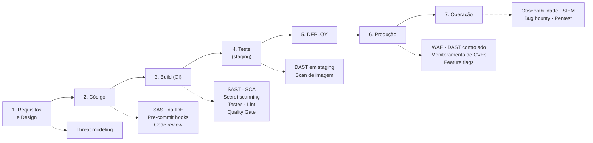

# Parte 1 — Pesquisa teórica

**Aluno:** Anthony Muller
**Disciplina:** Segurança da Informação — Unifebe
**Repositório:** https://github.com/AnthonyViniciusMuller/banco-facil-api

---

## 1. Shift Left e Shift Right

Quando desenhamos o ciclo de vida de desenvolvimento como uma linha do tempo horizontal, o tempo corre da esquerda para a direita: requisitos e design à esquerda, produção à direita. Shift Left é antecipar as atividades de verificação para as fases mais à esquerda dessa linha. Shift Right é o movimento oposto: levar verificação e monitoramento para depois do deploy, tratando a produção como ambiente legítimo de teste, sob controle.

O termo não nasceu na segurança. Ele vem dos testes ágeis (Larry Smith, "Shift-Left Testing", 2001), onde significava antecipar o teste em relação à codificação. A comunidade de segurança adotou o vocabulário nos anos 2010, junto com o DevSecOps.

```mermaid
flowchart LR
    A["1. Requisitos<br/>e Design"] --> B["2. Código"] --> C["3. Build (CI)"] --> D["4. Teste<br/>(staging)"] --> E["5. DEPLOY"] --> F["6. Produção"] --> G["7. Operação"]

    A -.-> A1["Threat modeling"]
    B -.-> B1["SAST na IDE<br/>Pre-commit hooks<br/>Code review"]
    C -.-> C1["SAST · SCA<br/>Secret scanning<br/>Testes · Lint<br/>Quality Gate"]
    D -.-> D1["DAST em staging<br/>Scan de imagem"]
    F -.-> F1["WAF · DAST controlado<br/>Monitoramento de CVEs<br/>Feature flags"]
    G -.-> G1["Observabilidade · SIEM<br/>Bug bounty · Pentest"]
```

*Figura 1 — Linha do tempo do SDLC. A fronteira entre os dois movimentos é o deploy: antes dele é prevenção, depois é detecção e contenção.*

**Controles típicos de cada lado.** À esquerda ficam SAST, detecção de segredos e SCA. À direita, DAST contra produção, observabilidade com detecção de anomalias (SIEM, WAF) e deploy progressivo com feature flags ou canary. O critério de classificação não é a ferramenta, e sim de qual insumo o controle depende: se o insumo é o artefato estático (código, manifesto, imagem), ele pode ser antecipado; se é o comportamento do sistema sob tráfego real, ele necessariamente pertence à direita.

**São complementares, não concorrentes.** Shift Left reduz a probabilidade de a falha chegar à produção; Shift Right reduz o impacto e o tempo de detecção das que chegam mesmo assim. Classes inteiras de vulnerabilidade escapam do melhor pipeline: erros de configuração de ambiente (um bucket aberto, o Actuator exposto num perfil errado), falhas de autorização (o SAST não sabe que `/conta?id=` deveria restringir o acesso à conta do próprio usuário autenticado) e, principalmente, CVEs publicadas depois do deploy.

Este último é o caso mais didático. Em 8 de dezembro de 2021, uma aplicação com `log4j-core 2.14.1` passava em qualquer scanner do mundo. No dia seguinte, com a divulgação da CVE-2021-44228, a mesma aplicação, sem uma linha alterada, era crítica. Nenhuma quantidade de Shift Left evitaria isso: o que resolve é inventário atualizado, monitoramento contínuo e capacidade de mitigar via WAF enquanto a correção é implantada.

**Custo de correção por fase.** A intuição é sólida: quanto mais tarde o defeito é descoberto, mais artefatos derivados dele já existem e mais pessoas precisam ser envolvidas. Corrigir no design é mudar um documento; corrigir no código custa minutos do autor com o contexto fresco; no CI, um novo commit; em staging, um ciclo entre QA e desenvolvimento. Em produção somam-se indisponibilidade ou fraude em curso, plantão, comunicação a clientes e exposição regulatória — para uma fintech, LGPD e normas do Bacen.

A afirmação mais repetida do setor é que corrigir em produção custa de 30 a 100 vezes o custo de corrigir nos requisitos. Vale desconfiar do número. Ele costuma ser atribuído a três fontes: Boehm, em *Software Engineering Economics* (1981), que é a origem legítima da curva, mas mediu projetos em cascata dos anos 1970, com releases medidos em anos; o "IBM System Sciences Institute", fonte do gráfico 1x/6.5x/15x/100x que circula em centenas de apresentações e que Laurent Bossavit tentou rastrear em *The Leprechauns of Software Engineering* sem encontrar nenhum artigo primário, nem evidência de que tal instituto tenha publicado o estudo; e o relatório NIST/RTI de 2002, que é sério, mas trata de custo macroeconômico agregado e não valida multiplicador por defeito individual.

A leitura honesta é que a direção da curva é bem sustentada e a magnitude não é. Em entrega contínua, com deploy várias vezes ao dia e rollback automatizado, a distância entre corrigir no CI e corrigir em produção é bem menor do que era em 1981 — e esse encurtamento é justamente o argumento do Shift Right. O investimento em Shift Left se defende sem o número inflado: pelo custo de contexto, pelo custo de propagação em uma arquitetura com dezenas de microsserviços, e pelo custo irreversível de um segredo exposto, que não pode ser "descommitado".

## 2. Gestão de segredos

**Secret sprawl** é a proliferação descontrolada de credenciais por sistemas e repositórios que não foram feitos para guardá-las, a ponto de a organização perder a resposta para três perguntas: quais segredos existem, onde estão e quem tem acesso. A GitGuardian publica anualmente o relatório *State of Secrets Sprawl*, e as edições recentes reportam mais de dez milhões de novos segredos detectados por ano só em commits públicos do GitHub — o que mostra que o problema é sistêmico, não descuido individual.

As formas mais comuns de vazamento são o commit "temporário" que nunca é revertido (o caso da BancoFácil), arquivos de configuração versionados, segredos em imagens Docker via `ENV` ou arquivos copiados, e logs que despejam cabeçalhos de autorização ou strings de conexão. A armadilha mais mal compreendida é o **histórico do Git**: remover o segredo do arquivo e commitar a remoção não o remove do repositório. Ele continua acessível em `git log -p`, em qualquer clone e em qualquer fork. Por isso o Gitleaks varre o histórico inteiro, e não só o estado atual dos arquivos.

**Segredos de build e de runtime são coisas diferentes.** Um segredo de build (o `GITHUB_TOKEN` para publicar no GHCR, a credencial de um registry) existe apenas durante a execução do workflow e deve morar no cofre do próprio CI. Um segredo de runtime (string de conexão, chave do gateway de pagamentos) precisa existir com a aplicação já rodando, muito depois de o workflow terminar, e deve vir de um cofre com injeção no deploy. Confundir os dois leva ao antipadrão de injetar segredo de runtime como variável de build, que é exatamente o que o assa dentro da imagem.

**Por que não pode estar na imagem, mesmo com repositório privado.** A imagem não é opaca: qualquer um com permissão de pull extrai o valor com `docker history` ou descompactando as camadas. Camadas são imutáveis, então copiar um arquivo e removê-lo depois não apaga nada. A imagem circula muito além do registry — cache de cada nó, máquinas de desenvolvedores, backups. E o segredo dentro dela acopla artefato e ambiente, quebrando o *build once, deploy anywhere* e transformando rotação em rebuild, o que na prática significa que a rotação não acontece. Privacidade do repositório reduz o alcance, não elimina: no caso Uber de 2016, atacantes obtiveram credenciais de AWS a partir de um repositório **privado** e chegaram aos dados de 57 milhões de usuários.

**Duas categorias de ferramenta.** Na detecção estão Gitleaks (binário Go, ~150 regras de regex por provedor mais entropia, varre o histórico completo), TruffleHog (que além de detectar o padrão faz verificação ativa, chamando a API do provedor para saber se a chave ainda é válida) e o GitHub Secret Scanning, cujo modo *push protection* rejeita o push no momento em que ele ocorre — o exemplo mais puro de Shift Left possível, porque o segredo nunca chega a existir no servidor. No gerenciamento centralizado estão HashiCorp Vault (com controle de acesso por política, auditoria e credenciais dinâmicas de TTL curto), AWS Secrets Manager (com rotação automática nativa), Azure Key Vault e, restrito ao escopo de CI, o GitHub Actions Secrets.

A diferença de propósito é a de um alarme de incêndio para um cofre de banco. Detecção é controle detectivo: assume que a falha pode ocorrer e a encontra rápido. Gerenciamento é controle preventivo: elimina a razão para o segredo estar no código. Só a segunda resolve o problema; a primeira existe porque a segunda nunca será perfeita.

**Rotação** é a substituição da credencial por uma nova, com invalidação da anterior no sistema que a emitiu. Quando um segredo é encontrado exposto, ela é a única ação que encerra a exposição, e o raciocínio é simples: remover o segredo do código altera o que está publicado a partir de agora, mas não altera o que já foi lido. A chave da BancoFácil ficou seis meses em repositório público — pôde ser clonada, indexada e coletada por bots que varrem o GitHub em tempo real. Apagar o arquivo não invalida nenhuma dessas cópias. A ordem correta é rotacionar, auditar os logs do provedor em busca de uso a partir de origens desconhecidas, remover do código, e só então considerar reescrever o histórico.

## 3. Proteção e qualidade

**Branch Protection** é o conjunto de regras que a plataforma aplica do lado do servidor sobre um branch. A característica decisiva é ser server-side: diferente de um hook local, que cada desenvolvedor pode não instalar, a regra é avaliada pela plataforma no momento do push e não há como contorná-la. No GitHub dá para exigir pull request antes do merge, exigir um número mínimo de aprovações (inclusive de Code Owners), exigir que os checks de status passem, exigir que o branch esteja atualizado com a base, proibir force-push e deleção, exigir commits assinados e aplicar as regras também a administradores — sem esta última, a regra vira recomendação para quem tem permissão de admin.

**Quality Gate** é um conjunto de condições objetivas, avaliadas automaticamente, que um artefato precisa satisfazer para avançar, e cuja reprovação interrompe o fluxo. O conceito é formalizado no SonarQube, onde o resultado é binário: *Passed* ou *Failed*. A diferença em relação a um relatório é autoridade, não informação — os dois produzem o mesmo conhecimento, o gate acrescenta consequência. Tecnicamente, a diferença é o código de saída do processo: o `--error` do Semgrep e o `exit-code: 1` do Trivy, usados na Parte 2, são exatamente o que transforma análise em gate. Sem eles, a ferramenta imprime os mesmos achados e o job termina verde. O gate também resiste à erosão: uma lista de problemas que cresce sem consequência é racionalmente ignorada pela equipe.

**Testes unitários** entram na estratégia de segurança por quatro motivos. Primeiro, porque muitos defeitos de segurança são defeitos de corretude: um off-by-one é um buffer overflow em C, e um erro de arredondamento em cálculo financeiro é falha de integridade. O bug plantado nesta atividade, o desconto dividido por 1000 em vez de 100, é apresentado como bug funcional, mas numa fintech é falha de integridade de transação — e quem o detectou foi o teste, não o SAST. Segundo, porque codificam invariantes como regressão executável: depois de corrigir a SQL Injection, um teste que verifica que `buscarConta("1' OR '1'='1")` não retorna todas as contas impede que a falha volte num refactor. Terceiro, porque exercitam os caminhos de erro, onde as vulnerabilidades de validação de entrada se concentram. Quarto, porque viabilizam a correção rápida: aplicar um patch de segurança em horas depende inteiramente da confiança de que a mudança não quebrou o resto.

Sobre cobertura e superfície de risco, a relação é real mas assimétrica. Baixa cobertura é forte indicador de risco. Alta cobertura não implica baixo risco, porque cobertura de linha mede se a linha foi executada, não se o comportamento foi verificado — é trivial chegar a 90% com testes sem asserção significativa. Use a cobertura como alarme para o que está abaixo do piso, não como certificado do que está acima.

**As três juntas** formam a primeira linha porque estabelecem as precondições sem as quais nenhuma ferramenta especializada funciona. Branch Protection cria o ponto de controle: sem ela existe o caminho do push direto, e uma pipeline que pode ser contornada não é um controle, é uma sugestão. Quality Gates dão consequência ao achado: a ferramenta mais cara do mercado, em modo informativo, tem o mesmo efeito prático que nenhuma ferramenta. Testes dão a rede de segurança que torna a correção barata. Há ainda um argumento de custo: essas três práticas são baratas, determinísticas e praticamente sem falso positivo, enquanto ferramentas de segurança são estatísticas por natureza e exigem triagem. Começar pelas caras numa organização que ainda permite push direto na `main` é como programas de DevSecOps perdem a adesão das equipes.

## 4. SAST, DAST e SCA

**SAST** é a análise do código sem executá-lo, em busca de padrões associados a vulnerabilidades. É caixa-branca e, dependendo da ferramenta, o insumo é o código-fonte (Semgrep, SonarQube) ou o bytecode (SpotBugs com FindSecBugs). As análises mais sofisticadas fazem *taint analysis*: rastreiam o dado de uma origem não confiável (o `@RequestParam String id`) até uma operação sensível (o `executeQuery`) e reportam o caminho quando não há sanitização no meio. Roda o mais cedo possível: IDE, pre-commit, CI logo após o commit. Não depende de build completo nem de ambiente implantado.

**DAST** testa a aplicação em execução, enviando requisições de fora e analisando as respostas. É caixa-preta — OWASP ZAP e Burp Suite são os típicos, com *spider* para mapear a superfície e *active scan* para injetar payloads. Exige a aplicação rodando porque seu objeto de teste não é o código, é o sistema completo: aplicação mais servidor, proxy reverso, WAF, TLS, cabeçalhos, sessão e integrações. Boa parte do que ele encontra sequer está no código-fonte — um cookie sem `HttpOnly`, um método HTTP habilitado por padrão, um certificado expirado. Isso o obriga a entrar depois de um estágio de deploy, em ambiente efêmero ou staging. Como um scan completo leva de dezenas de minutos a horas, é comum rodá-lo em cadência noturna ou por release em vez de a cada commit.

**SCA** inventaria os componentes de terceiros, diretos e transitivos, e confronta o inventário com bases públicas (NVD, OSV, GitHub Advisory). Seu produto central é o SBOM, nos formatos CycloneDX ou SPDX. A motivação é aritmética: numa aplicação Java típica, a fração do bytecode implantado escrita pela própria equipe raramente passa de alguns por cento. O `spring-boot-starter-web` deste projeto traz dezenas de artefatos que ninguém declarou.

O caso que consolidou o SCA como obrigatório é o **Log4Shell (CVE-2021-44228)**, divulgado em 9 de dezembro de 2021 com CVSS 10.0. A falha estava no `log4j-core` (versões 2.0-beta9 a 2.14.1, exatamente a versão plantada nesta atividade): o mecanismo de lookup JNDI interpretava uma expressão dentro de uma mensagem de log e carregava código remoto. Bastava que um dado controlado pelo atacante — um `User-Agent`, um campo de formulário — chegasse a qualquer chamada de log. Três lições saíram dali. A primeira é que o inventário é o controle: no dia 10, a pergunta que travou milhares de empresas não foi "como corrigir", que era trivial, mas "onde nós usamos isso?". A segunda é que dependências transitivas dominam — a maioria das aplicações afetadas nunca declarou `log4j-core`. A terceira é que a janela de exposição é retroativa.

| | SAST | DAST | SCA |
|---|---|---|---|
| **O que analisa** | Código-fonte ou bytecode próprio | A aplicação em execução, vista de fora | Dependências diretas e transitivas |
| **Quando roda** | IDE, pre-commit, CI | Depois de um deploy (staging ou produção) | CI a cada commit e continuamente sobre o que já está implantado |
| **Ferramentas** | Semgrep, SonarQube, SpotBugs, CodeQL | OWASP ZAP, Burp Suite, Nuclei | Trivy, Grype, Dependency-Check, Dependabot, Snyk |
| **Detecta** | Injeção, XSS, criptografia fraca, segredos em código, desserialização insegura | Configuração, cabeçalhos ausentes, cookies sem flags, sessão, autenticação quebrada, TLS | CVEs conhecidas, versões fora de suporte, conflitos de licença, typosquatting |
| **Limitações** | Muitos falsos positivos; cego para lógica de negócio, autorização e configuração de runtime | Falsos negativos por cobertura incompleta; lento; não aponta o local no código; risco de efeito colateral nos dados | Só conhece CVEs já publicadas; reporta a vulnerabilidade mesmo quando o caminho nunca é executado |

**Posicionamento.** SAST é puramente Shift Left: seu insumo é o artefato estático e rodá-lo em produção analisaria o mesmo código já disponível no commit. DAST é o controle dos dois lados — à esquerda contra um staging levantado pela pipeline, à direita contra produção em janela controlada, porque só ela tem a configuração, o WAF e os certificados reais. SCA também atua dos dois lados, e essa é a parte contraintuitiva: como gate de entrada ele impede a introdução de uma dependência vulnerável, mas avalia o mundo no dia do commit. Como novas CVEs são publicadas continuamente, um artefato aprovado hoje pode estar crítico amanhã sem nenhuma mudança. Fechar o ciclo exige SBOM por artefato implantado, reavaliação contínua do inventário contra as bases de CVE e capacidade de mitigação virtual enquanto a correção é construída.

Em resumo: Shift Left garante que não introduzimos o problema conhecido; Shift Right garante que descobrimos o problema que passou a existir depois.

## 5. Infraestrutura e contêineres

**Hardening** é a redução deliberada da superfície de ataque da imagem: manter o mínimo necessário, com o mínimo de privilégio, de forma reproduzível. Cada binário, biblioteca e shell presentes na imagem final e não usados pela aplicação são ferramentas gratuitas para quem conseguir executar código dentro do contêiner.

Más práticas comuns: usar a tag `latest` ou nenhuma tag (Hadolint DL3007), o que torna o build irreproduzível e deixa entrar regressões da base sem nenhuma mudança no repositório; executar como `root` (DL3002); usar imagem base grande demais, como `openjdk:latest`, que traz JDK, compilador, `curl` e gerenciador de pacotes; usar `ADD` em vez de `COPY` (DL3020), já que o `ADD` baixa URLs e extrai tarballs automaticamente; copiar segredos para dentro da imagem; não usar multi-stage, deixando Maven, cache `~/.m2` e código-fonte na imagem de produção; não fixar versões de pacotes instalados; não limpar o cache do gerenciador na mesma camada; e copiar o contexto inteiro sem `.dockerignore`, levando junto o `.git` com todo o histórico.

**Princípio do Menor Privilégio.** Em contêineres, significa rodar como usuário não-privilegiado, com sistema de arquivos raiz somente leitura, sem capabilities desnecessárias e sem `--privileged`. O argumento de que "a aplicação precisa de root" confunde privilégio de aplicação com privilégio de sistema. Na ausência de user namespace remapping, que não é o padrão em boa parte das instalações, o root do contêiner é o root do host: o isolamento vem de namespaces, cgroups e seccomp, não de uma identidade de usuário diferente. Uma vulnerabilidade no kernel ou no runtime transforma comprometimento de aplicação em comprometimento do nó, e partindo de um usuário sem privilégio a mesma cadeia exige um passo a mais. Além disso, a necessidade quase sempre é contornável: portas privilegiadas se resolvem usando porta alta e deixando o mapeamento para o orquestrador, e escrita em diretórios do sistema se resolve ajustando a propriedade no build com `--chown`. O NIST SP 800-190 e o CIS Docker Benchmark tratam execução não-root como controle de linha de base.

**Multi-stage build** usa vários `FROM` no mesmo Dockerfile, e só o último vira a imagem publicada. No caso deste projeto, o primeiro estágio parte de `maven:3.9-eclipse-temurin-17` e compila; o segundo parte de `eclipse-temurin:17-jre-alpine` e copia apenas o `.jar`. A imagem final não contém Maven, JDK, compilador, código-fonte nem o cache `~/.m2`. Isso reduz a superfície por dois caminhos: menos componentes significam menos CVEs e menos manutenção, e em caso de comprometimento o atacante não encontra um compilador nem um gerenciador de pacotes para montar o próximo passo. A redução de tamanho costuma ser de uma ordem de grandeza, o que também encurta o tempo de rollout — e portanto o tempo de resposta a um incidente que exija redeploy.

**Ferramentas.** O **Hadolint** faz o linting do Dockerfile contra um catálogo de regras e embute o ShellCheck para validar os comandos dentro de cada `RUN`. É SAST aplicado à infraestrutura: roda em milissegundos e não constrói nada. O parâmetro `failure-threshold` é o que o converte em Quality Gate. Ele não vê o conteúdo das camadas, só as instruções — daí a necessidade da segunda categoria. O **Trivy** decompõe a imagem já construída e identifica tanto os pacotes do sistema operacional quanto as dependências de aplicação embutidas nos artefatos, comparando com NVD, OSV e GHSA; também gera SBOM. Alternativas equivalentes são o Grype, da Anchore, e o Docker Scout. O par ideal usa os dois em momentos distintos: Hadolint antes do build, Trivy depois — e, em Shift Right, Trivy de novo periodicamente sobre as imagens já em produção, porque a imagem não muda mas o banco de CVEs sim.

## Referências

BOEHM, Barry W. *Software Engineering Economics*. Prentice-Hall, 1981.

BOSSAVIT, Laurent. *The Leprechauns of Software Engineering*. Leanpub, 2015.

CIS. *CIS Docker Benchmark*. Center for Internet Security. Disponível em: https://www.cisecurity.org/benchmark/docker

DOCKER. *Multi-stage builds* e *Best practices for writing Dockerfiles*. Disponível em: https://docs.docker.com/build/building/multi-stage/

GITGUARDIAN. *State of Secrets Sprawl*. Disponível em: https://www.gitguardian.com/state-of-secrets-sprawl-report

GITHUB DOCS. *About protected branches*; *About secret scanning*; *Automatic token authentication*. Disponível em: https://docs.github.com/

HADOLINT. *Dockerfile linter — rules reference*. Disponível em: https://github.com/hadolint/hadolint

NIST. *SP 800-190: Application Container Security Guide*. 2017. Disponível em: https://csrc.nist.gov/publications/detail/sp/800-190/final

NIST. *SP 800-218: Secure Software Development Framework (SSDF) v1.1*. 2022. Disponível em: https://csrc.nist.gov/publications/detail/sp/800-218/final

NIST/RTI. *The Economic Impacts of Inadequate Infrastructure for Software Testing*. Planning Report 02-3, 2002.

NVD. *CVE-2021-44228*. Disponível em: https://nvd.nist.gov/vuln/detail/CVE-2021-44228

OWASP. *DevSecOps Guideline*; *Top 10*; *Secrets Management Cheat Sheet*. Disponível em: https://owasp.org/

SMITH, Larry. *Shift-Left Testing*. Dr. Dobb's Journal, 2001.

SONARSOURCE. *Quality Gates*. Disponível em: https://docs.sonarsource.com/sonarqube/

AQUA SECURITY. *Trivy Documentation*. Disponível em: https://trivy.dev/
